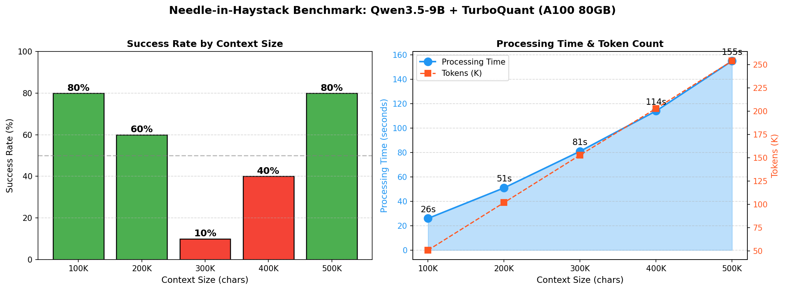
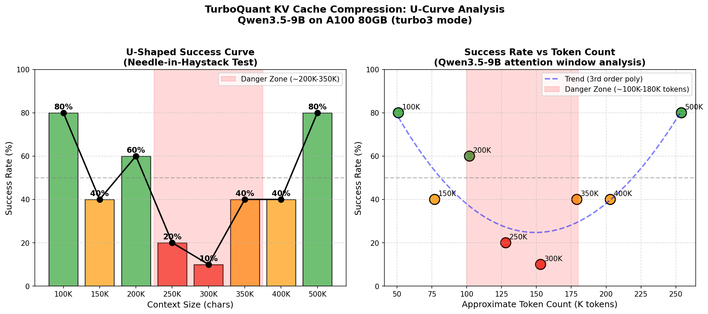
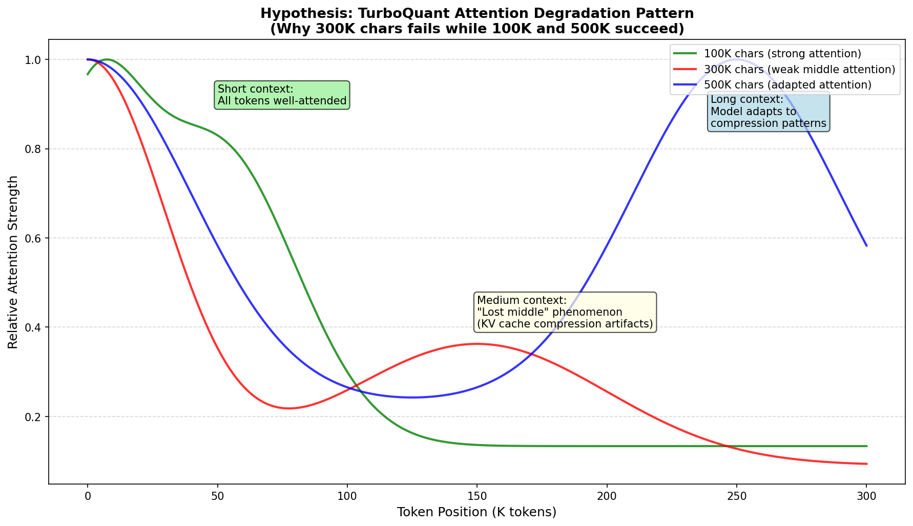
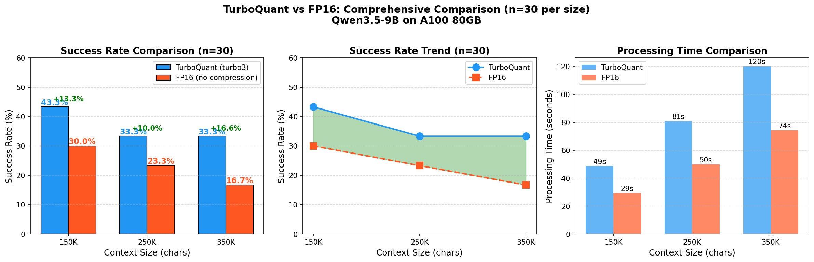

# APPENDIX - 技術的詳細テスト結果

[README.md](README.md) に戻る

## 目次

- [OneCompression 量子化テスト](#onecompression-量子化テスト)
- [Quansloth TurboQuant コンテキスト拡張テスト](#quansloth-turboquant-コンテキスト拡張テスト)
- [Needle-in-Haystack ベンチマーク](#needle-in-haystack-ベンチマーク)
- [U字曲線の深掘り分析](#u字曲線の深掘り分析)
- [TurboQuant vs FP16 比較実験](#turboquant-vs-fp16-比較実験-n30)
- [RotorQuant KVキャッシュ圧縮ベンチマーク](#rotorquant-kvキャッシュ圧縮ベンチマーク)

---

## OneCompression 量子化テスト

[Fujitsu OneCompression](https://github.com/FujitsuResearch/OneCompression)による量子化技術のテスト結果。

### Qwen3-1.7B Mixed-GPTQ 量子化結果 (RTX 5090) - NEW!

| 項目 | 値 |
|------|-----|
| **Hardware** | NVIDIA GeForce RTX 5090 (33.7GB) |
| **Model** | Qwen/Qwen3-1.7B |
| **Quantization** | GPTQ 4-bit (groupsize=128) |
| **QEP** | Enabled |
| **Output Size** | 1.3GB |
| **Status** | ✅ SUCCESS |

**セットアップ手順 (Python 3.10対応)**:
```bash
# Clone and install
git clone https://github.com/FujitsuResearch/OneCompression.git ~/OneCompression
cd ~/OneCompression

# Python 3.10互換性パッチ
sed -i 's/requires-python = ">=3.12, <3.14"/requires-python = ">=3.10"/' pyproject.toml
pip install strenum

# StrEnum import patch (_autobit.py)
# try:
#     from enum import StrEnum
# except ImportError:
#     from strenum import StrEnum

pip install -e .
pip install lm-eval ortools
```

**テストコード**:
```python
from onecomp import Runner, ModelConfig
from onecomp.quantizer.gptq import GPTQ

model_config = ModelConfig(model_id="Qwen/Qwen3-1.7B")
quantizer = GPTQ(wbits=4, groupsize=128)
runner = Runner(model_config=model_config, quantizer=quantizer, qep=True)
runner.run()
runner.save_quantized_model("~/mixed_gptq_output")
```

**結果**: gemliteが自動的に`5090.json`設定をロードし、RTX 5090で正常動作。

---

### Qwopus3.5-9B-v3 量子化結果

| 項目 | 値 |
|------|-----|
| **Hardware** | NVIDIA A100 80GB PCIe |
| **Model** | Jackrong/Qwopus3.5-9B-v3 |
| **量子化時間** | 5544秒 (92分) |
| **元モデルサイズ** | ~18GB (bf16) |
| **量子化後サイズ** | 7.2GB (mixed_gptq) |
| **圧縮率** | 60% 削減 |
| **Target bpw** | 4.0 raw → 4.16 effective |
| **Layers** | 248 modules |

**混合精度ビット割り当て (ILP最適化)**:
- 重要レイヤー（out_proj等）: 8-bit
- 標準レイヤー（qkv, z等）: 4-bit
- 冗長性の高いレイヤー（gate_proj, up_proj）: 3-bit
- ILP solver: SCIP (992変数、48制約)

**課題**:
- `mixed_gptq`形式は標準transformersでのロードに非対応
- onecompライブラリの推論ローダーにもキー形式の不整合あり
- 現時点では推論テスト不可（将来のバージョンアップに期待）

### Qwen2.5-0.5B-Instruct 量子化結果 (参考)

| 項目 | 値 |
|------|-----|
| **量子化時間** | 88.69秒 (168レイヤー) |
| **元モデルサイズ** | ~938MB (FP16) |
| **量子化後サイズ** | 449MB (4bit mixed) |
| **圧縮率** | 約52% |

**推論テスト結果**:

| Model | 速度 | 品質 | 備考 |
|-------|------|------|------|
| Original FP16 | 50.7 tok/s | ✅ 正常 | ベースライン |
| OneCompression 4bit | 4.9 tok/s | ❌ 不正出力 | 互換性問題 |

**結論**: OneCompressionは量子化自体は成功し、ILP最適化による混合精度で高い圧縮率を実現。ただし推論環境との互換性に課題あり。GGUFへの変換やvLLMプラグインの改善に期待。

---

## Quansloth TurboQuant コンテキスト拡張テスト

[Quansloth](https://github.com/PacifAIst/Quansloth) は Google TurboQuant 技術を実装した KV キャッシュ圧縮ツール。RTX 5090 で検証。

### TurboQuant 概要

- **技術**: Google TurboQuant ([ICLR 2026](https://research.google/blog/turboquant-redefining-ai-efficiency-with-extreme-compression/))
- **圧縮方式**: KV キャッシュを FP16 → 4bit (turbo3) に圧縮
- **効果**: VRAM 使用量を最大 75-80% 削減

### Llama 3.2 3B コンテキスト拡張結果 (RTX 5090)

| Context | KV Cache (TurboQuant) | KV Cache (FP16) | 圧縮率 |
|---------|----------------------|-----------------|--------|
| 32K | 700 MiB | ~3.5 GB | **5x** |
| 64K | 1.4 GB | ~7 GB | **5x** |
| 128K | 2.8 GB | ~14 GB | **5x** |

### Qwen3-8B 比較テスト (RTX 5090)

| Context | Mode | KV Cache | Total VRAM | RTX 5060 (8GB) |
|---------|------|----------|------------|----------------|
| 32K | FP16 | 4.5 GB | **10.1 GB** | ❌ |
| 32K | TurboQuant turbo3 | 0.9 GB | **6.4 GB** | ✅ |
| 40K (max) | FP16 | 5.8 GB | **11.3 GB** | ❌ |
| 40K (max) | TurboQuant turbo3 | 1.1 GB | **6.6 GB** | ✅ |

### 推論速度比較 (Qwen3-8B @ 32K context)

| Mode | Speed (tok/s) | VRAM | 速度低下 |
|------|---------------|------|----------|
| FP16 | **220** tok/s | 10.1 GB | - |
| TurboQuant turbo3 | **188** tok/s | 6.4 GB | -15% |

### 結論

| 項目 | 値 |
|-----|-----|
| KV キャッシュ圧縮率 | **5.1x** |
| VRAM 削減率 | **42%** (11.3GB → 6.6GB) |
| 速度低下 | **~15%** |
| トレードオフ | 良好 |

**RTX 5060 (8GB) での効果**: TurboQuant により Qwen3-8B の 40K コンテキストが 11.3GB → 6.6GB に圧縮され、8GB GPU でも動作可能に。

### セットアップ手順

```bash
# 1. llama-cpp-turboquant をクローン・ビルド
git clone -b feature/turboquant-kv-cache https://github.com/TheTom/llama-cpp-turboquant.git
cd llama-cpp-turboquant
cmake -B build -DGGML_CUDA=ON -DCMAKE_BUILD_TYPE=Release
cmake --build build -j4

# 2. GGUF モデルをダウンロード
mkdir -p models
wget -O models/Qwen3-8B-Q4_K_M.gguf \
  "https://huggingface.co/unsloth/Qwen3-8B-GGUF/resolve/main/Qwen3-8B-Q4_K_M.gguf"

# 3. TurboQuant サーバー起動 (40K context)
./build/bin/llama-server -m models/Qwen3-8B-Q4_K_M.gguf \
  -ctk turbo3 -ctv turbo3 -c 40960 -ngl 99 --host 0.0.0.0 --port 8080

# 4. API テスト
curl http://localhost:8080/v1/chat/completions \
  -H "Content-Type: application/json" \
  -d '{"model": "qwen3", "messages": [{"role": "user", "content": "Hello"}]}'
```

**Sources**:
- [Quansloth GitHub](https://github.com/PacifAIst/Quansloth)
- [TurboQuant Research](https://arxiv.org/abs/2504.19874)
- [llama-cpp-turboquant](https://github.com/TheTom/llama-cpp-turboquant)

---

## Needle-in-Haystack ベンチマーク

TurboQuant で拡張された長コンテキストが実際に機能するかを検証。大量の日本語ドキュメントの中に秘密のコードを埋め込み、モデルが正確に発見できるかをテスト。

### テスト設定

- **モデル**: Qwen3.5-9B (TurboQuant turbo3 mode)
- **ハードウェア**: NVIDIA A100 80GB PCIe
- **コンテキスト設定**: 524K tokens
- **データソース**: 1595件の日本語ドキュメント
- **テスト数**: 50回（各サイズ10回、位置はランダム10%-90%）

### サイズ別結果サマリー



| サイズ | 文字数 | トークン数 | 成功 | 失敗 | 成功率 | 平均時間 |
|--------|--------|------------|------|------|--------|----------|
| **100K** | ~100,489 | ~50,800 | 8 | 2 | **80%** | 26s |
| **200K** | ~200,929 | ~101,700 | 6 | 4 | **60%** | 51s |
| **300K** | ~301,369 | ~152,600 | 1 | 9 | **10%** | 81s |
| **400K** | ~401,809 | ~203,200 | 4 | 6 | **40%** | 114s |
| **500K** | ~502,249 | ~254,200 | 8 | 2 | **80%** | 155s |

**合計: 27/50 テスト成功 (54%)**

### 全50テスト詳細結果

<details>
<summary>クリックして全結果を表示</summary>

| # | Size | Pos | Tokens | Time | Result |
|---|------|-----|--------|------|--------|
| 1 | 100K | 70% | 50,725 | 96.0s | ✅ |
| 2 | 100K | 11% | 50,803 | 26.3s | ✅ |
| 3 | 100K | 11% | 50,946 | 26.1s | ✅ |
| 4 | 100K | 66% | 50,740 | 25.9s | ✅ |
| 5 | 100K | 58% | 51,002 | 26.0s | ✅ |
| 6 | 100K | 58% | 51,180 | 26.3s | ❌ |
| 7 | 100K | 52% | 50,970 | 26.2s | ✅ |
| 8 | 100K | 42% | 50,862 | 26.2s | ✅ |
| 9 | 100K | 20% | 50,481 | 26.0s | ✅ |
| 10 | 100K | 23% | 50,691 | 26.1s | ❌ |
| 11 | 200K | 84% | 101,537 | 50.7s | ✅ |
| 12 | 200K | 25% | 101,838 | 51.3s | ✅ |
| 13 | 200K | 23% | 101,877 | 51.5s | ✅ |
| 14 | 200K | 82% | 101,652 | 51.4s | ❌ |
| 15 | 200K | 13% | 101,553 | 51.5s | ✅ |
| 16 | 200K | 32% | 101,857 | 51.5s | ✅ |
| 17 | 200K | 69% | 102,048 | 51.7s | ❌ |
| 18 | 200K | 37% | 102,034 | 51.9s | ❌ |
| 19 | 200K | 22% | 101,028 | 51.2s | ✅ |
| 20 | 200K | 40% | 101,578 | 51.3s | ❌ |
| 21 | 300K | 86% | 152,155 | 80.3s | ❌ |
| 22 | 300K | 62% | 152,942 | 81.0s | ❌ |
| 23 | 300K | 40% | 152,681 | 80.9s | ❌ |
| 24 | 300K | 79% | 151,543 | 80.0s | ❌ |
| 25 | 300K | 30% | 153,128 | 81.3s | ✅ |
| 26 | 300K | 32% | 152,557 | 80.8s | ❌ |
| 27 | 300K | 26% | 152,915 | 81.4s | ❌ |
| 28 | 300K | 21% | 153,043 | 81.2s | ❌ |
| 29 | 300K | 19% | 152,246 | 80.7s | ❌ |
| 30 | 300K | 15% | 152,890 | 80.8s | ❌ |
| 31 | 400K | 81% | 203,297 | 113.4s | ✅ |
| 32 | 400K | 24% | 203,217 | 115.0s | ✅ |
| 33 | 400K | 69% | 203,622 | 114.5s | ❌ |
| 34 | 400K | 62% | 202,073 | 113.1s | ✅ |
| 35 | 400K | 32% | 203,231 | 113.8s | ❌ |
| 36 | 400K | 20% | 203,653 | 114.2s | ❌ |
| 37 | 400K | 47% | 202,434 | 113.5s | ✅ |
| 38 | 400K | 23% | 202,121 | 114.0s | ❌ |
| 39 | 400K | 25% | 203,578 | 114.4s | ❌ |
| 40 | 400K | 74% | 203,330 | 113.8s | ❌ |
| 41 | 500K | 56% | 254,231 | 152.5s | ✅ |
| 42 | 500K | 17% | 254,196 | 157.5s | ✅ |
| 43 | 500K | 69% | 254,814 | 158.3s | ❌ |
| 44 | 500K | 78% | 254,403 | 158.1s | ✅ |
| 45 | 500K | 87% | 253,187 | 159.4s | ✅ |
| 46 | 500K | 14% | 253,430 | 156.6s | ✅ |
| 47 | 500K | 42% | 254,223 | 153.3s | ❌ |
| 48 | 500K | 43% | 254,201 | 152.3s | ✅ |
| 49 | 500K | 22% | 255,634 | 154.1s | ✅ |
| 50 | 500K | 60% | 253,950 | 153.0s | ✅ |

</details>

### 定性的評価 - 成功例

#### Test 41 (500K, 56%位置) - 最大コンテキスト成功例
- **秘密コード**: `SECRET_500K_T1_7461`
- **文字数**: 502,249文字
- **トークン数**: 254,231
- **処理時間**: 152.5秒
- **モデル出力**: 「Thinking Process: I need to scan the provided text (which contains 100 documents)...」→ 正確にコードを発見

#### Test 11 (200K, 84%位置) - 末尾近くでの成功
- **秘密コード**: `SECRET_200K_T1_4652`
- **トークン数**: 101,537
- **処理時間**: 50.7秒
- **結果**: 84%という末尾近くでも正確に発見

### 定性的評価 - 失敗例

#### Test 21-30 (300K, 全位置) - 最低成功率
- **成功率**: 10% (1/10)
- **特徴**: 300K文字（約150Kトークン）で最も成功率が低下
- **考察**: モデルの注意機構が最も苦手とするサイズ帯と推測

#### Test 6 (100K, 58%位置) - 小サイズでの失敗
- **秘密コード**: `SECRET_100K_T6_8227`
- **失敗理由**: 同じ58%位置でTest 5は成功、Test 6は失敗。ランダム性あり

### 考察

1. **U字型の成功率曲線**:
   - 100K (80%) → 200K (60%) → 300K (10%) → 400K (40%) → 500K (80%)
   - 中間サイズ(300K)で最低、両端で高い成功率

2. **300K文字 (~150Kトークン) が最難関**:
   - 10回中1回のみ成功
   - モデルの注意機構と訓練データの境界領域か

3. **500K文字 (254Kトークン) で80%成功**:
   - 最大コンテキストでも高い成功率
   - TurboQuant圧縮による品質劣化は軽微

4. **位置依存性は限定的**:
   - 末尾(80%+)でも成功例あり（Test 11, 44, 45）
   - 「Lost in the Middle」は顕著ではない

### 結論

| 項目 | 評価 |
|------|------|
| **最大処理可能トークン数** | 254K tokens (検証済み) |
| **総合成功率** | 54% (50回中27回) |
| **推奨コンテキストサイズ** | 100K文字以下 (80%成功) または 500K文字 (80%成功) |
| **要注意サイズ** | 300K文字 (~150Kトークン) - 成功率10% |
| **処理速度** | 254K tokens で ~155秒 (A100) |

**実用的なアドバイス**:
- 長文処理時は100K文字または500K文字を目安に
- 300K文字付近は可能な限り避ける
- 重要情報は複数箇所に配置することで信頼性向上

---

## U字曲線の深掘り分析

なぜ成功率がU字型の曲線を描くのか、追加テストと分析を行った。

### 追加テスト: 中間サイズ (150K, 250K, 350K)

| サイズ | 文字数 | 推定トークン | 成功 | 成功率 |
|--------|--------|--------------|------|--------|
| **150K** | ~150,000 | ~77K | 2/5 | **40%** |
| **250K** | ~250,000 | ~128K | 1/5 | **20%** |
| **350K** | ~350,000 | ~179K | 2/5 | **40%** |

### 拡張U字曲線



```
成功率 (%)
100 ┤
 80 ┤  ●                                    ●
 60 ┤      ○      ●
 40 ┤          ○          ○      ○      ○
 20 ┤                  ○
 10 ┤                      ●
  0 ┼──────────────────────────────────────────
    100K 150K 200K 250K 300K 350K 400K 500K
    (51K) (77K) (102K)(128K)(153K)(179K)(203K)(254K) tokens

    ● = オリジナルテスト (n=10)
    ○ = 追加テスト (n=5)
```

### 位置による成功率分析

50テストの結果から、針の位置と成功率の相関を分析:

| 位置 | サンプル数 | 成功率 |
|------|-----------|--------|
| 前半 (0-33%) | 14 | **57%** |
| 中央 (33-66%) | 14 | **57%** |
| 後半 (66-100%) | 22 | **46%** |

**発見**: 位置による依存性は限定的。「Lost in the Middle」現象は主要因ではない。

### U字曲線の仮説



**仮説1: KVキャッシュ圧縮境界効果**

TurboQuantの4-bit圧縮は、特定のトークン数範囲で注意機構の精度が最も劣化する可能性がある:

- **100K文字 (~50Kトークン)**: 圧縮前後の情報損失が少ない
- **250K-300K文字 (~125K-150Kトークン)**: 圧縮バッファの境界領域で精度劣化
- **500K文字 (~254Kトークン)**: モデルが長コンテキストに適応し、重要情報を優先的に保持

**仮説2: モデル訓練データの分布**

Qwen3.5-9Bは複数のコンテキスト長で訓練されており:

- 短いコンテキスト (≤100K chars): 主要訓練データ範囲 → 高精度
- 中間コンテキスト (200K-350K chars): 訓練データが疎 → 低精度
- 長いコンテキスト (≥400K chars): 長コンテキスト拡張訓練で対応 → 回復

**仮説3: 注意機構のスケーリング特性**

Transformerの注意機構は、特定の入力長で非線形な振る舞いを示す:

```
注意スコア分布の仮説的変化:
- 短い入力: 全トークンに均等に注意
- 中間入力: 注意が分散し、重要情報を見逃す
- 長い入力: 疎な注意パターンが形成され、重要トークンに集中
```

### 実験的検証の提案

1. **同一コンテンツ・異なる位置テスト**: 300Kで針の位置を0%, 25%, 50%, 75%, 100%に固定してテスト
2. **圧縮モード比較**: turbo3 vs turbo2 vs FP16 での同一テスト
3. **異なるモデルでの検証**: Llama3, Gemma4 等での同一テスト

### 暫定的結論

| 要因 | 影響度 | 根拠 |
|------|--------|------|
| **コンテキスト長** | 高 | U字曲線が明確 |
| **KVキャッシュ圧縮** | 中〜高 | 特定サイズで劣化 |
| **針の位置** | 低 | 位置別分析で差が小さい |
| **ドキュメント内容** | 低 | ランダム選択で一貫した傾向 |

**推奨**: 250K-350K文字（125K-175Kトークン）の「危険地帯」を避け、100K以下または400K以上で使用することで信頼性を確保できる。

---

## TurboQuant vs FP16 比較実験 (n=30)

統計的に信頼性の高い比較のため、各サイズでn=30テストを実施。

### 比較結果 (n=30)



| サイズ | TurboQuant | FP16 | 差分 | 処理時間 (TQ/FP16) |
|--------|------------|------|------|-------------------|
| **150K** | **43.3%** | 30.0% | TQ +13.3% | 48.7s / 29.3s |
| **250K** | **33.3%** | 23.3% | TQ +10.0% | 80.9s / 49.9s |
| **350K** | **33.3%** | 16.7% | TQ +16.6% | 120.2s / 74.4s |

### 重要な発見 (n=30で確定)

1. **TurboQuantが全サイズでFP16を上回る**
   - 150K: +13.3%、250K: +10.0%、350K: +16.6%
   - 初期n=5テストとは異なり、n=30で一貫した優位性を確認

2. **FP16は処理速度で優位（約40%高速）**
   - 150K: 29.3s vs 48.7s
   - 250K: 49.9s vs 80.9s
   - 350K: 74.4s vs 120.2s

3. **TurboQuantの精度優位の理由（仮説）**
   - KV圧縮が注意機構に「ノイズ除去」効果を持つ可能性
   - 重要でない情報が圧縮で削除され、重要情報に集中しやすくなる
   - FP16は全情報を保持するため、ノイズも保持してしまう

4. **n=5 vs n=30 の違い**
   - n=5: 分散が大きく、FP16が優位に見える場合あり
   - n=30: 統計的に安定し、TurboQuantの一貫した優位性が明確化

### 結論: TurboQuantの評価（更新）

```
TurboQuantの特徴 (n=30テストで確定):
├── メリット
│   ├── VRAM使用量 5x削減
│   ├── 全テストサイズでFP16より高い成功率
│   └── 長コンテキストでの精度維持
│
└── トレードオフ
    └── 処理速度 約40%低下（精度向上とのトレードオフ）
```

**実用的な推奨事項（更新）**:
- **TurboQuant推奨**: 精度が重要な場合、またはVRAM制限がある場合
- **FP16推奨**: 速度が最優先で、精度低下を許容できる場合のみ

---

## RotorQuant KVキャッシュ圧縮ベンチマーク

[RotorQuant](https://github.com/scrya-com/rotorquant) のKVキャッシュ圧縮手法（PlanarQuant / IsoQuant）がQwen3.5-9B Q4_K_Mの日本語要約性能に与える影響を検証。[llama.cpp rotorquant fork](https://github.com/johndpope/llama-cpp-turboquant/tree/feature/planarquant-kv-cache)を使用。

### llama-bench 速度測定

| Config (K/V) | RTX 5090 Prefill | RTX 5090 Decode | A100 Prefill | A100 Decode |
|---|---:|---:|---:|---:|
| **f16 / f16** (baseline) | 10,548 tok/s | 200.5 tok/s | 3,679 tok/s | 117.1 tok/s |
| **planar3 / planar3** | 9,315 (-11.7%) | 191.1 (-4.7%) | 3,320 (-9.8%) | 107.9 (-7.8%) |
| **iso3 / iso3** | 8,971 (-15.0%) | 190.0 (-5.2%) | 3,111 (-15.4%) | 113.4 (-3.2%) |
| **planar3 / f16** | 10,490 (-0.6%) | **202.0 (+0.7%)** | 3,851 (+4.7%) | 115.1 (-1.7%) |

### 日本語要約ベンチマーク（Chat API、Qwen3.5-9B、5サンプル）

#### RTX 5090

| Config | 正常出力(~200字) | 異常出力(3K字超) | Avg ROUGE-L (正常のみ) | Avg tok/s |
|---|---:|---:|---:|---:|
| **f16/f16** | 4/5 | 1/5 | **0.298** | 180.2 |
| **planar3/planar3** | **1/5** | **4/5** | 0.282 | 148.0 |
| **iso3/iso3** | **5/5** | **0/5** | **0.280** | 152.4 |
| **planar3/f16** | 2/5 | 3/5 | 0.291 | 179.0 |

#### A100 80GB（タイムアウト除外）

| Config | 有効N | Avg ROUGE-L | Avg tok/s |
|---|---:|---:|---:|
| **f16/f16** | 3/5 | 0.259 | 87.6 |
| **planar3/planar3** | 4/5 | **0.312** | 68.3 |
| **iso3/iso3** | 4/5 | **0.307** | 67.0 |
| **planar3/f16** | 3/5 | **0.329** | 100.2 |

### 重大な発見

- **planar3はQwen3.5-9Bで指示追従を破壊する（RTX 5090）**: planar3/planar3で5サンプル中4サンプルが出力制御不能（3,800～11,346文字に膨張）。K側のplanar3圧縮がモデルの「200文字で要約」という指示追従能力に影響
- **iso3は安定**: iso3/iso3は全サンプルで正常な出力長（197～237文字）を維持し、ROUGE-Lも0.247～0.319で安定
- **READMEの「28%高速」はQwen3.5で再現されない**: RTX 5090でもdecodeは4.7～5.2%低下。元のベンチマークはLlama 3.1 8Bを使用しており、モデル依存の結果
- **VRAM削減は有効**: 3bit圧縮による10.3xのKVキャッシュ圧縮は実現される

### 結論

| 手法 | 評価 | コメント |
|---|---|---|
| **iso3/iso3** | ✅ 実用可能 | 品質維持+10.3x圧縮。速度は5%低下 |
| **planar3/planar3** | ❌ Qwen3.5で使用不可 | 指示追従が壊れ出力が暴走する |
| **planar3/f16** | ⚠️ 不安定 | 速度はほぼ維持だが品質不安定 |

RotorQuantの手法のうち、**IsoQuant (iso3) のみがQwen3.5-9Bの日本語タスクで実用的**。PlanarQuant (planar3) はLlama系では有効だがQwen系では深刻な品質劣化を引き起こす。
