# Japanese LLM Benchmark

A benchmark tool for evaluating Japanese language capabilities of various LLMs.

## 目次 (Table of Contents)

- [Features / Installation / Usage](#features)
- [コーディングベンチマーク](#コーディングベンチマーク-reactチャットアプリ生成)
  - [デザイン品質評価（ローカルVLM）](#デザイン品質評価-ローカルvlm-qwen25vl32b)
- [RTX 5090 (32GB) ベンチマーク](#rtx-5090-32gb-ベンチマーク)
  - [総合ランキング](#総合ランキング)
  - [定性的評価 (S+/S/A/B/C/D Tier)](#定性的評価)
  - [キーワード抽出ベンチマーク](#キーワード抽出ベンチマーク)
  - [VLM (Vision Language Model) ベンチマーク](#vlm-vision-language-model-ベンチマーク)
- [RTX 5060 (8GB) ベンチマーク](#rtx-5060-8gb-ベンチマーク)
  - [Gemma 4 ベンチマーク](#gemma-4-ベンチマーク結果-2026年4月リリース)
- [Mac (Apple Silicon) ベンチマーク](#mac-apple-silicon-ベンチマーク)
- [DGX Spark (GB10) ベンチマーク](#dgx-spark-gb10-ベンチマーク)
- [大規模モデル (A100) テスト](#大規模モデルa100テスト)
- [特殊環境が必要なモデル](#特殊環境が必要なモデル)
- [APPENDIX](APPENDIX.md) - 量子化テスト、Needle-in-Haystack、TurboQuant/RotorQuant詳細
- [License](#license)

---

## Features

- **ROUGE Score Evaluation**: Measures summarization quality using ROUGE-1, ROUGE-2, and ROUGE-L
- **Speed Benchmarking**: Measures tokens per second for each model
- **WebUI**: Interactive web interface for running benchmarks and visualizing results
- **Multiple Model Support**: Works with any Ollama-compatible model

## Requirements

- Python 3.10+
- Ollama running locally
- 8GB+ VRAM (for full GPU inference)

## Installation

```bash
pip install -r requirements.txt
```

## Usage

### WebUI Mode

```bash
python app.py
```

Access the WebUI at `http://localhost:8080`

### CLI Mode

```bash
python benchmark.py --dataset dataset.jsonl --models nemotron-3-nano:4b qwen3:4b --samples 10
```

## Dataset Format

JSONL file with the following structure:

```json
{"text": "Long Japanese text to summarize...", "summary": "Reference summary"}
```

---

# RTX 5090 (32GB) ベンチマーク

RTX 5090 (32GB) - 7000文字長文テキスト - 定性的評価

## 総合ランキング

| Rank | Model | ROUGE-L | Speed | Size | Tier |
|------|-------|---------|-------|------|------|
| 🥇 | **Qwopus3.5-9B** ⚠️ | **0.533** | 196 tok/s | 5.4GB | S+ |
| 🆕 | **Qwen3.5-9B** (公式) | 0.492 | 197 tok/s (5090) | 5.4GB | S+ |
| 🆕 | **OmniCoder-9B** ⚠️ | 0.382 | 195 tok/s | 5.4GB | A |
| 🆕 | **Bonsai-8B** | 0.400 | 325 tok/s | 1.2GB | A |
| 🆕 | **qwen3.6:35b-a3b** | 0.302 | 75.4 tok/s | 23GB | A |
| 1 | qwen3:30b-a3b | 0.347 | 200 tok/s | 18.6GB | S |
| 2 | qwen3:8b | 0.333 | 204 tok/s | 5.2GB | S |
| 3 | gemma4:e4b | 0.32* | 109 tok/s | 9.6GB | A |
| 4 | gemma4:e2b | 0.30* | 157 tok/s | 7.2GB | A |
| 5 | gemma3:12b | 0.303 | 141 tok/s | 8.1GB | A |
| 4 | qwen3-128k | 0.302 | 203 tok/s | 5.2GB | A |
| 5 | qwen3:14b | 0.292 | 128 tok/s | 9.3GB | A |
| 6 | gpt-oss-128k | 0.288 | 259 tok/s | 13.8GB | A |
| 7 | mistral-small | 0.285 | 96 tok/s | 14.3GB | A |
| 8 | SmallThinker-21BA3B | 0.268 | 256 tok/s | 13GB | B |
| 9 | ELYZA 8B | 0.258 | 241 tok/s | 4.9GB | B |
| 10 | llama3.2:3b | 0.246 | 427 tok/s | 2.0GB | B |
| 11 | gemma3:4b | 0.243 | 286 tok/s | 3.3GB | B |
| 12 | mistral:7b | 0.196 | 244 tok/s | 4.4GB | C |
| 13 | LLM-JP 1.8b | 0.150 | 609 tok/s | 1.2GB | D |
| 14 | phi4-mini | 0.107 | 378 tok/s | 2.5GB | D |
| 15 | nemotron-mini | 0.048 | 366 tok/s | 2.7GB | D |

---

## 定性的評価

### S+ Tier - 最高品質

#### Qwopus3.5-9B-v3 (NEW!) - RTX 5090 / A100
- **ROUGE-L**: 0.533 | **Speed**: 196 tok/s (5090) / 108 tok/s (A100) | **Size**: 5.4GB

> ⚠️ **ライセンス上の懸念**: このモデルは「Claude Opusの構造化推論習慣を蒸留」して訓練されたと明記されています。[Anthropicの利用規約](https://support.claude.com/en/articles/12326764-can-i-use-my-outputs-to-train-an-ai-model)では、Claude出力を使用して汎用チャットボットや競合AIモデルを訓練することを禁止しています。商用利用の際はライセンスリスクにご注意ください。

**生成例**:
> 大規模言語モデルとAgenticAIは、デジタルツインや自律的行動など新たな応用をもたらす。技術主導から人間性・倫理・市民参加を重視する情報エコシステムへ。印刷革命に続くデジタル革命で、市民が情報の創造・検証に参加する双方向性が重要。AI倫理や多様な価値観の対話、学際的視点による新たなルール作りが、未来社会の構築に不可欠だ。

**評価**:
- ✅ **ROUGE-L 0.533で最高精度**（qwen3:235bを超える！）
- ✅ 詳細なThinking過程を出力（英語）
- ✅ 5.4GBで8GB VRAMでも動作可能
- ✅ RTX 5090で196 tok/sの高速推論
- ⚠️ llama.cpp必須（Ollamaは非対応）
- ⚠️ **Claude蒸留によるライセンスリスク**（商用利用注意）

**動作方法**:
```bash
# llama.cpp をビルド
git clone https://github.com/ggml-org/llama.cpp && cd llama.cpp
cmake -B build -DGGML_CUDA=ON && cmake --build build --target llama-cli -j8

# モデルをダウンロード
curl -L -o Qwen3.5-9B.Q4_K_M.gguf \
  "https://huggingface.co/Jackrong/Qwopus3.5-9B-v3-GGUF/resolve/main/Qwen3.5-9B.Q4_K_M.gguf"

# 推論実行
./build/bin/llama-cli -m Qwen3.5-9B.Q4_K_M.gguf -p "要約してください..." -ngl 99
```

---

#### Qwen3.5-9B (公式モデル) - RTX 5090 / V100
- **ROUGE-L**: 0.492 (Q8_0) / 0.371 (Q4_K_M) | **Speed**: 197 tok/s (5090) / 59.5 tok/s (V100) | **Size**: 5.4GB (Q4_K_M) / 9.5GB (Q8_0)

**生成例**:
> デジタル技術、特に AI の急速な発展は社会に大きな変化をもたらしています。自然言語処理や画像認識など、人間に匹敵する性能を発揮するようになり、医療や交通など多方面で恩恵をもたらしています。一方で、プライバシー侵害や雇用問題、AI 判断の不透明性といった課題も浮上しています。今後、これらの技術を賢明に活用し、負の影響を最小化しながら持続可能な社会を築くことが求められています。

**Thinking過程（英語）**:
> The user wants me to summarize the given Japanese text into approximately 200 characters. Let me first analyze the original text: 1. Digital technology development bringing big changes... 2. AI progress is remarkable... 3. This innovation has both positive and negative aspects...

**評価**:
- ✅ 公式Qwen3.5-9Bモデル（ライセンス面でクリーン）
- ✅ 英語でのThinking過程を出力（構造的な分析）
- ✅ 要約品質が高い（原文の要点を的確に抽出）
- ✅ 文章が自然で読みやすい
- ⚠️ Q8_0で9.5GB（16GB以上のVRAM推奨）
- ⚠️ V100で59.5 tok/s（RTX 5090ならより高速）

**動作方法**:
```bash
# HuggingFaceからGGUFをダウンロード
curl -L -o Qwen3.5-9B.Q8_0.gguf \
  "https://huggingface.co/lmstudio-community/Qwen3.5-9B-GGUF/resolve/main/Qwen3.5-9B-Q8_0.gguf"

# 推論実行
./build/bin/llama-cli -m Qwen3.5-9B.Q8_0.gguf -p "要約してください..." -ngl 99
```

---

### S Tier - 卓越した品質（実用レベルで推奨）

#### qwen3:30b-a3b (MoE)
- **ROUGE-L**: 0.347 | **Speed**: 200 tok/s | **Size**: 18.6GB

**生成例 (Sample 1)**:
> 大規模言語モデルは目的別・ユーザー別にカスタマイズされ、多様性を持つべきという考え方が広がっている。AgenticAIがユーザーの好みを学習し、デジタルツインとしてメール返信や意思決定を担う未来が描かれる。技術主導型の未来戦略において、人間性や倫理、市民参加が不可欠と認識が拡大。欧州はプライバシー保護を最優先に、北米は市場主導型のアプローチを取るなど、地域ごとのAI倫理のアプローチが異なる。

**評価**:
- ✅ 主要論点を網羅（LLM、デジタルツイン、倫理、国際協調）
- ✅ 「欧州 vs 北米」の具体的対比を保持
- ✅ 日本語として自然で読みやすい

---

#### qwen3:8b
- **ROUGE-L**: 0.333 | **Speed**: 204 tok/s | **Size**: 5.2GB

**生成例 (Sample 1)**:
> 大規模言語モデルの応用が注目され、ユーザー別カスタマイズやデジタルツインとしてのAgenticAIの可能性が示される。AI倫理や市民参加の重要性が強調され、欧米アジアの地域差も。技術と人間性の融合が未来の情報エコシステムの基盤となる。

**評価**:
- ✅ 117文字で非常に簡潔
- ✅ 核心的キーワードを的確に抽出
- ✅ 8GB VRAMで動作可能
- ⚠️ 一部文末が唐突

---

### A Tier - 高品質（多くの用途で推奨）

#### Bonsai-8B (NEW!) - 1-bit Quantization
- **ROUGE-L**: 0.400 | **Speed**: 325 tok/s | **Size**: 1.16GB

**生成例**:
> 大規模言語モデルは、技術主導型の未来戦略に人間性や倫理が不可欠であると認識されています。AgenticAIは、長期間の対話を通じてユーザーの好みを学習し、代わりに行動する可能性があります。情報エコシステムでは、多様な視点や文化が融合し、市民の参加が促進されています。

**評価**:
- ✅ **1-bit量子化で1.16GB**（超軽量！）
- ✅ 325 tok/sの超高速推論
- ✅ 8Bパラメータの品質を維持
- ⚠️ PrismML版llama.cpp必須

**動作方法**:
```bash
# PrismML版 llama.cpp をビルド（1-bit対応）
git clone https://github.com/PrismML-Eng/llama.cpp && cd llama.cpp
cmake -B build -DGGML_CUDA=ON && cmake --build build -j8

# モデルをダウンロード
curl -L -o Bonsai-8B.gguf \
  "https://huggingface.co/prism-ml/Bonsai-8B-gguf/resolve/main/Bonsai-8B.gguf"

# 推論実行
./build/bin/llama-cli -m Bonsai-8B.gguf -p "..." -ngl 99 --temp 0.5
```

---

#### Qwen3.6:35B-A3B (NEW!) - MoE Agentic Model
- **ROUGE-L**: 0.302 | **Speed**: 75.4 tok/s | **Size**: 23GB (Ollama Q4)

[Qwen3.6](https://qwen.ai/blog?id=qwen3.6) の最初のオープンウェイトモデル。35Bパラメータ中3Bアクティブ（MoE）。エージェントコーディング特化。

> 📌 `qwen3.6:35b` タグは `qwen3.6:35b-a3b` と同一digest (`07d35212591f`) であることを確認。Ollama 0.20.0 で動作。

| Sample | Time | Tok/s | ROUGE-L | 出力長 |
|---|---:|---:|---:|---:|
| 0 | 59.5s | 76.3 | 0.338 | 158字 |
| 1 | 24.9s | 75.6 | **0.413** | 199字 |
| 2 | 23.2s | 76.0 | 0.305 | 170字 |
| 3 | 40.5s | 75.7 | 0.231 | 169字 |
| 4 | 21.9s | 75.2 | 0.338 | 202字 |
| 5 | 39.0s | 74.1 | 0.355 | 158字 |
| 6 | 39.4s | 74.6 | 0.268 | 165字 |
| 7 | 53.6s | 75.4 | 0.295 | 181字 |
| 8 | 45.4s | 75.6 | 0.253 | 146字 |
| 9 | 33.3s | 75.9 | 0.226 | 176字 |
| **Avg** | **38.1s** | **75.4** | **0.302** | **172字** |

##### 再検証 (`qwen3.6:35b` タグ, RTX 5090, 2026-04-29, n=10)

`qwen3.6:35b` タグでの再現テスト。同一digestのため同一モデル動作確認。

| Sample | Time | Tok/s | ROUGE-L |
|---|---:|---:|---:|
| 0 | 55.71s | 71.5 | 0.318 |
| 1 | 44.87s | 71.9 | **0.413** |
| 2 | 30.19s | 72.1 | 0.246 |
| 3 | 34.56s | 71.9 | 0.271 |
| 4 | 39.51s | 72.0 | 0.404 |
| 5 | 26.25s | 72.1 | 0.350 |
| 6 | 43.70s | 72.0 | 0.291 |
| 7 | 27.41s | 72.0 | **0.418** |
| 8 | 50.76s | 71.8 | 0.271 |
| 9 | 20.25s | 72.0 | 0.204 |
| **Avg** | **37.32s** | **71.9** | **0.319** |

ROUGE-1: 0.601 / ROUGE-2: 0.308 / ROUGE-L: 0.319。10サンプル平均で **71.9 tok/s** と前回計測 (75.4 tok/s) に近い数値で再現。

**定性評価**:
- ✅ **流暢さ 5/5**: 完璧な日本語。文法エラーゼロ
- ✅ **一貫性 5/5**: 「技術革新→課題→倫理・市民参加」の論理構成が明確
- ✅ **簡潔さ 5/5**: 出力長146~202字で非常に安定
- ⚠️ **正確さ 4/5**: 主題は正確だが原文固有の具体例（GDPR、東日本大震災等）を省略し抽象化する傾向
- ⚠️ **独自性 2/5**: 全サンプルが「技術と倫理の融合」「持続可能な情報エコシステム」で締めるテンプレ化

**vs qwen3:30b-a3b (前世代MoE)**:

| 項目 | qwen3.6:35b-a3b | qwen3:30b-a3b |
|---|---|---|
| ROUGE-L | 0.302 | **0.347** |
| Speed | 75.4 tok/s | **200 tok/s** |
| Size | 23GB | 18.6GB |

**結論**: Qwen3.6はエージェントコーディング向けに最適化されたモデルであり、日本語要約タスクでは前世代のqwen3:30b-a3b（ROUGE-L 0.347、200 tok/s）を下回る。要約タスクではQwen3.5系が依然として優位。**A Tier (4.0/5)**。

---

#### OmniCoder-9B (NEW!) - RTX 5090
- **ROUGE-L**: 0.382 | **Speed**: 195 tok/s | **Size**: 5.4GB (Q4_K_M)

> ⚠️ **ライセンス上の懸念**: このモデルは「Claude Opus 4.6のコーディング推論トレース」で訓練されたと明記されています。Qwopusと同様のライセンスリスクにご注意ください。

**生成例**:
> 大規模言語モデルの応用は注目すべきです。さらに、目的やユーザー別にカスタマイズされ、多様性を持つべきという考え方もあります。AgenticAI は長期間にわたってユーザーと対話し、好みや思考パターンを学習し続けます。その結果、ある意味でユーザーのデジタルツインとなり、忙しい時にメールの返信や会議への出席、意思決定を代行する未来が訪れると想像されます。

**評価**:
- ✅ Qwen3.5-9Bベースのコーディング特化モデル
- ✅ 英語でのThinking過程を出力
- ✅ Apache 2.0ライセンス（ただしClaude蒸留の懸念）
- ⚠️ 要約タスクでは公式Qwen3.5-9Bと同等の性能
- ⚠️ **Claude Opus 4.6蒸留によるライセンスリスク**

**動作方法**:
```bash
# モデルをダウンロード
curl -L -o omnicoder-9b-q4_k_m.gguf \
  "https://huggingface.co/Tesslate/OmniCoder-9B-GGUF/resolve/main/omnicoder-9b-q4_k_m.gguf"

# 推論実行
./build/bin/llama-cli -m omnicoder-9b-q4_k_m.gguf -p "要約してください..." -ngl 99
```

---

#### gemma3:12b
- **ROUGE-L**: 0.303 | **Speed**: 141 tok/s | **Size**: 8.1GB

> 大規模言語モデルの進化は、個々のニーズに合わせたカスタマイズや「デジタルツイン」としての活用を可能にし...技術と倫理の融合による、市民参加型の情報倫理構築が鍵となる。

- ✅ 主要概念を正確に抽出
- ✅ 225文字で適切な長さ
- ⚠️ 国際比較の視点がやや弱い

#### qwen3-128k
- **ROUGE-L**: 0.302 | **Speed**: 203 tok/s | **Size**: 5.2GB

> 大規模言語モデルの応用が注目され、カスタマイズされたAgenticAIがユーザーのデジタルツインとして活用される。情報エコシステムの多様性と倫理的課題が強調され...

- ✅ 115文字と非常に簡潔
- ✅ 128Kコンテキスト対応
- ⚠️ 簡潔すぎて詳細が欠落

#### gpt-oss-128k
- **ROUGE-L**: 0.288 | **Speed**: 259 tok/s | **Size**: 13.8GB

- ✅ 具体的な応用例を挙げている
- ✅ 128Kコンテキスト対応
- ⚠️ 一部文章が不自然

#### mistral-small
- **ROUGE-L**: 0.285 | **Speed**: 96 tok/s | **Size**: 14.3GB

- ✅ 内容の網羅性が高い
- ✅ EU vs 米国のアプローチの違いを明記
- ⚠️ 324文字とやや長め

---

### B Tier - 標準的品質（用途によっては使用可能）

#### SmallThinker-21BA3B (MoE)
- **ROUGE-L**: 0.268 | **Speed**: 256 tok/s | **Size**: 13GB (21B MoE, 3B active)

**生成例**:
> グーテンベルクによる活版印刷は知識の民主化と市民意識の啓蒙に革命的影響を与えた。現代では、インターネットやブロックチェーン技術がその精神を継承し、情報の透明性とオープンアクセスを実現する。

- ✅ MoEで高速（256 tok/s）
- ✅ キーワード抽出が優秀（F1=0.880）
- ✅ 自然な日本語出力
- ⚠️ 要約は中程度の品質
- ⚠️ 13GBで8GB VRAMでは動作不可

#### ELYZA 8B
- **ROUGE-L**: 0.258 | **Speed**: 241 tok/s | **Size**: 4.9GB

- ✅ 日本語特化モデルらしく文法が自然
- ✅ 160文字で適切な長さ
- ⚠️ 「国際協調」の視点が弱い

#### llama3.2:3b
- **ROUGE-L**: 0.246 | **Speed**: 427 tok/s | **Size**: 2.0GB

- ✅ 3Bパラメータながら主要概念を捉えている
- ⚠️ 「この文脈において」という不要な前置き
- ⚠️ やや冗長な表現

#### gemma3:4b
- **ROUGE-L**: 0.243 | **Speed**: 286 tok/s | **Size**: 3.3GB

- ✅ 内容は正確
- ❌ 503文字と非常に長い（要約として不適切）
- ⚠️ 簡潔さに欠ける

---

### C Tier - 品質に課題あり（限定的な用途のみ）

#### mistral:7b
- **ROUGE-L**: 0.196 | **Speed**: 244 tok/s | **Size**: 4.4GB

> 1. ローカルAIのセキュリティに関する主な注意点は、シリコングラフィックス社の創業と...2. プレイヤーに休みの時間を忘れるな。3. さらに弾幕系の敵を追加して...

- ❌ 番号リスト形式で要約として不適切
- ❌ 無関係な内容が混入（ゲーム関連）
- ❌ ハルシネーション発生

---

### D Tier - 非推奨（日本語要約タスクに不適合）

#### LLM-JP 1.8b
- **ROUGE-L**: 0.150 | **Speed**: 609 tok/s

- ❌ 原文の要約ではなく一般的な説明を生成
- ❌ 原文にない例（Siri, Alexa）を挙げている
- ❌ 要約タスクを理解していない

#### phi4-mini
- **ROUGE-L**: 0.107

- ❌ 2/3のサンプルでタイムアウトエラー
- ❌ 成功した1件も内容が断片的
- ❌ 安定性に重大な問題

#### nemotron-mini
- **ROUGE-L**: 0.048

- ❌ 3サンプル中2件が空出力
- ❌ 1件の出力も原文と無関係
- ❌ 日本語要約タスクに完全に不適合

---

## 評価軸別 最優秀モデル

| 評価軸 | 最優秀 | コメント |
|--------|--------|----------|
| 内容の正確性 | **Qwopus3.5-9B** | ROUGE-L 0.533で最高精度 |
| 簡潔さ | qwen3:8b / qwen3:14b | 100文字以下で要点を凝縮 |
| 日本語の自然さ | gemma3:12b | 文法的に最も自然 |
| 速度と品質のバランス | **Bonsai-8B** | 325 tok/s、ROUGE-L 0.400、1.2GB |
| コストパフォーマンス | **Bonsai-8B** | 1.2GBで8Bパラメータ相当の品質 |
| 8GB VRAM最適 | **Qwopus3.5-9B** | 5.4GBで235Bを超える精度 |
| Ollama対応 | qwen3:8b | Ollamaで使える最高品質 |

---

## 注意が必要なモデル

- **mistral:7b**: 長文でハルシネーション発生
- **LLM-JP 1.8b**: 要約タスクを理解せず
- **phi4-mini**: 接続エラーが頻発
- **nemotron-mini**: 日本語出力がほぼ空

---

## 評価環境

- **Hardware**: RTX 5090 (32GB) / RTX 5060 (8GB)
- **Sample Size**: ~7000 chars/sample (3 samples)
- **Thinking Models**: 128K context, 32K output
- **Date**: April 2026

---

# キーワード抽出ベンチマーク

質問文からキーワードを抽出するタスクの評価結果。「〇〇について教えて」「〇〇って何?」等の質問パターンから、検索用キーワードをJSON形式で抽出する能力を測定。

## タスク概要

- **入力**: 日本語の質問文（30パターン）
- **出力**: `{"keywords": ["キーワード1", "キーワード2", ...]}`
- **評価指標**: Precision, Recall, F1 Score

## キーワード抽出ランキング

| Rank | Model | F1 Score | Precision | Recall | Speed | Size |
|------|-------|----------|-----------|--------|-------|------|
| 1 | **qwen3:8b** | **0.899** | 0.956 | 0.883 | 225 tok/s | 5.2GB |
| 2 | mistral-small | 0.886 | 0.878 | 0.928 | 104 tok/s | 14.3GB |
| 3 | SmallThinker-21BA3B | 0.880 | 0.883 | 0.900 | 280 tok/s | 13GB |
| 4 | gemma3:4b | 0.859 | 0.784 | 1.022 | 312 tok/s | 3.3GB |
| 5 | gemma3:12b | 0.837 | 0.772 | 0.983 | 148 tok/s | 8.1GB |
| 6 | llama3.2:3b | 0.788 | 0.716 | 1.017 | 468 tok/s | 2.0GB |
| 🆕 | **Bonsai-8B** | 0.652 | 0.622 | 0.800 | 383 tok/s | 1.2GB |

**注意**:
- Bonsai-8Bは関連キーワードを豊富に抽出する傾向あり（Recallは高いがPrecisionが低め）
- Qwopus3.5-9Bは思考モード(thinking)が常時有効のため、キーワード抽出タスクには不向き。要約タスクに最適化。

---

## キーワード抽出 定性的評価

### S Tier - 高精度（実用レベルで推奨）

#### qwen3:8b
- **F1**: 0.899 | **Precision**: 0.956 | **Speed**: 225 tok/s

**生成例**:
| 質問 | 抽出キーワード |
|------|----------------|
| 機械学習について教えて | `["機械学習"]` |
| CNNとRNNの違いは? | `["CNN", "RNN"]` |
| クラウドコンピューティングのメリットとデメリット | `["クラウドコンピューティング", "メリット", "デメリット"]` |
| 大規模言語モデルのファインチューニングについて | `["大規模言語モデル", "ファインチューニング"]` |

**評価**:
- ✅ 最高精度（Precision 0.956）
- ✅ 余計なキーワードを追加しない
- ✅ 専門用語を正確に抽出
- ✅ JSON形式を正確に出力

---

#### mistral-small
- **F1**: 0.886 | **Precision**: 0.878 | **Speed**: 104 tok/s

**評価**:
- ✅ qwen3:8bに次ぐ高精度
- ✅ 安定したJSON出力
- ⚠️ 速度がやや遅い（104 tok/s）
- ⚠️ モデルサイズが大きい（14.3GB）

---

#### SmallThinker-21BA3B (MoE)
- **F1**: 0.880 | **Precision**: 0.883 | **Speed**: 280 tok/s

**生成例**:
| 質問 | 抽出キーワード |
|------|----------------|
| 機械学習について教えて | `["機械学習"]` |
| 量子コンピュータの原理って何ですか | `["量子コンピュータ", "原理"]` |
| クラウドコンピューティングのメリットとデメリット | `["クラウドコンピューティング", "メリット", "デメリット"]` |

**評価**:
- ✅ 高速（280 tok/s）でS Tierに迫る精度
- ✅ MoEアーキテクチャで効率的
- ⚠️ 英語キーワードが混入することがある（例: "architecture"）
- ⚠️ 13GBで8GB VRAMでは動作不可

---

### A Tier - 良好（多くの用途で使用可能）

#### gemma3:4b
- **F1**: 0.859 | **Precision**: 0.784 | **Speed**: 312 tok/s

**評価**:
- ✅ 高速（312 tok/s）
- ✅ 軽量（3.3GB）
- ⚠️ やや余計なキーワードを追加する傾向
- ⚠️ Recallが高くPrecisionが低め

#### gemma3:12b
- **F1**: 0.837 | **Precision**: 0.772 | **Speed**: 148 tok/s

**評価**:
- ✅ 安定した出力
- ⚠️ 4bと比べて大幅な性能向上なし
- ⚠️ サイズ対性能比が低い

---

### B Tier - 標準的（用途によっては使用可能）

#### llama3.2:3b
- **F1**: 0.788 | **Precision**: 0.716 | **Speed**: 468 tok/s

**生成例（課題あり）**:
| 質問 | 抽出キーワード | 問題点 |
|------|----------------|--------|
| ディープラーニングって何? | `["ディープラーニング", "AI", "マシンラーニング"]` | 余計なキーワード |
| LoRAとは何ですか | `["LoRA", "Lightweight Online ARchive"]` | 誤った展開 |
| プロンプトエンジニアリングのコツを教えて | `[]` | 抽出失敗 |

**評価**:
- ✅ 最高速（468 tok/s）
- ✅ 最軽量（2.0GB）
- ❌ 精度にばらつき
- ❌ 時々抽出失敗

---

## キーワード抽出 用途別推奨

| 用途 | 推奨モデル | 理由 |
|------|-----------|------|
| **高精度が必要** | qwen3:8b | F1=0.899、Precision=0.956で最高精度 |
| **速度重視** | llama3.2:3b | 468 tok/sで最速、精度は妥協 |
| **バランス型** | gemma3:4b | 312 tok/s、F1=0.859、3.3GBで軽量 |
| **8GB VRAM** | qwen3:8b | 5.2GBで最高性能 |

---

## キーワード抽出ベンチマーク使い方

```bash
python keyword_benchmark.py --host <ollama-host> --models qwen3:8b gemma3:4b --samples 30
```

### データセット形式

```json
{"question": "機械学習について教えて", "keywords": ["機械学習"]}
{"question": "CNNとRNNの違いは?", "keywords": ["CNN", "RNN", "違い"]}
```

---

## VLM (Vision Language Model) ベンチマーク

FLUX.2-klein-9Bで生成した画像をVLMで日本語説明するベンチマーク。

### 画像生成 (FLUX.2-klein-9B on RTX 5090)

| 項目 | 値 |
|------|-----|
| **Model** | black-forest-labs/FLUX.2-klein-9B |
| **Hardware** | NVIDIA GeForce RTX 5090 (33.7GB) |
| **Resolution** | 1024 x 1024 |
| **Inference Steps** | 4 |
| **Average Time** | 11-14s/image |

### VLM日本語説明テスト (Gemma3:12b)

| Image | Theme | VLM Time | Tokens | Success |
|-------|-------|----------|--------|---------|
| 1 | Japanese Temple | 5.34s | 500 | ✅ |
| 2 | Cyberpunk Tokyo | 5.69s | 392 | ✅ |
| 3 | Coral Reef | 5.77s | 487 | ✅ |
| 4 | Victorian London | 7.82s | 407 | ✅ |
| 5 | Tea Ceremony | 8.32s | 429 | ✅ |

**Gemma3:12b 出力例 (Japanese Temple)**:
> **1. 画像の主題や中心的な要素**
> この画像は、日本の伝統的な庭園（日本庭園）とその背景にある建造物を中心に捉えたものです。特に、以下の要素が目立ちます。
> * **石灯籠:** 庭園の随所に配置された石灯籠が、光の温かさを放ち、奥行きと静寂を演出しています。
> * **砂紋:** 白砂で丁寧に整えられた砂紋（砂の模様）は、庭園の重要な要素であり、水庭を表現しています。
> * **建物の屋根:** 日本建築特有の曲線的な屋根は、伝統的な美しさを象徴しています。

### VLMモデル推奨ランキング (日本語対応)

| Rank | Model | Japanese Support | VRAM | 推奨用途 |
|------|-------|------------------|------|----------|
| 1 | **Qwen3-VL** | Excellent (33言語) | 4-48GB+ | 日本語説明 |
| 2 | **Qwen2.5-VL** | Excellent (29言語) | 4-48GB+ | 汎用マルチリンガル |
| 3 | **MiniCPM-V** | Very Good (30言語) | 4-8GB | 効率的推論 |
| 4 | **Gemma 3** | Good (140言語) | 2.6-16GB | 軽量マルチリンガル |
| 5 | LLaVA | Limited | 8-24GB | 英語+翻訳 |
| ❌ | Llama 3.2 Vision | Poor (英語のみ) | 8-64GB | **非推奨** |

**推奨コマンド**:
```bash
# 日本語画像説明に最適
ollama run qwen3-vl:8b

# 軽量環境向け
ollama run gemma3:4b

# 高品質環境向け
ollama run qwen3-vl:32b
```

---

## コーディングベンチマーク: Reactチャットアプリ生成

LLMに「ログイン・フレンドフォロー・DM機能を持つReactチャットアプリ」を1プロンプトで生成させ、Docker内でビルド→Playwrightでe2eテスト→スクリーンショット撮影→デザイン評価を全自動で行うベンチマーク。

### 採点基準（100点満点）

| 項目 | 点数 | 判定方法 |
|---|---|---|
| ビルド成功 | 15 | npm install && build 成功 |
| サーバー起動 | 10 | localhost:3000 に応答 |
| ログイン/サインアップ | 15 | Playwright: アカウント作成→ログイン |
| フレンドフォロー/解除 | 15 | Playwright: フォロー→確認→解除 |
| DM送受信 | 15 | Playwright: メッセージ送信→相手側で確認 |
| リアルタイム更新 | 10 | Playwright: ポーリング/WSで自動表示 |
| デザイン品質 | 20 | VLM: スクショを5段階×5観点で評価 (Claude Vision またはローカルVLM) |

エラー発生時はエラーメッセージをLLMにフィードバックし、最大10回リトライ可能。リトライ回数も性能指標として記録。

デザイン品質評価は環境変数でバックエンドを選択できる（デフォルトはAnthropic API）:

```bash
# ローカルVLM (Ollama / llama-server のOpenAI互換エンドポイント) で外観検査
export VISUAL_EVAL_API=local
export VISUAL_EVAL_URL=http://localhost:11434/v1   # デフォルト
export VISUAL_EVAL_MODEL=qwen2.5vl-32b-16k         # qwen2.5vl:32b の num_ctx=16384 版

# 過去の全スクリーンショットを一括再評価
python3 run_visual_eval.py --output visual_eval_results.json
```

※ Ollamaでqwen2.5vl:32bをそのまま使うとデフォルト128kコンテキストのKVキャッシュ確保でOOMになるため、`PARAMETER num_ctx 16384` を指定した派生モデルを `ollama create` して使うこと。

### 結果

| Model | 生成時間 | リトライ | Build | Login | Friend | DM | RT | 機能 | TOTAL |
|---|---:|---:|---|---|---|---|---|---:|---:|
| **qwen3.6:35b-a3b-coding-mxfp8** | 148s | 0 | OK | OK | OK | OK | **OK** | **80/80** | **80/100** |
| **qwen3.6:27b** (RTX 5090) | 2678s | 2 | OK | OK | OK | OK | **OK** | **80/80** | **80/100** |
| 🆕 **DeepSeek-V4-Flash (ds4 q4)** | 307s | 0 | OK | OK | OK | OK | **OK** | **80/80** | **80/100** |
| **gpt-oss:20b** | 258s | 3 | OK | OK | OK | OK | **OK** | 75/80 | 75/100 |
| 🆕 **Qwen3.6-27B-MTP Q8_0** (A100, ggml-org, baseline) | 446s | 1 | OK | OK | OK | OK | OK | 75/80 | 75/100 |
| 🆕 **poolside Laguna-XS-2.1 Q4_K_M** (A100, llama.cpp) | 214s | 5 | OK | OK | OK | OK | **OK** | 75/80 | 75/100 |
| 🆕 **Qwen3.6-27B-MTP Q8_0** (A100, ggml-org, **+MTP n=3**) | **282s** | 1 | OK | OK | OK | OK | OK | 65/80 | 65/100 |
| Nemotron-3-Nano-Omni-30B (Q8_0) | 45s | 0 | OK | OK² | OK² | OK² | -- | 55/80² | 55/100² |
| Granite-4.1-30b-8bit | 1419s | 5 | -- | OK | OK | OK | -- | 55/80 | 55/100 |
| DeepSeek-V4-Flash IQ2XXS³ | 1879s | 5 | OK | OK | OK | OK | -- | 55/80 | 55/100 |
| 🆕 **JetBrains Mellum2-12B-A2.5B-Thinking (BF16)** (A100, transformers) | 8397s | 5 | OK | OK | OK | OK | -- | 55/80 | 55/100 |
| qwen3.6:35b-a3b | 167s | 0 | OK | OK | OK | OK | -- | 55/80 | 55/100 |
| 🆕 Qwen3.6-27B-MTP UD-Q4_K_XL (A100, unsloth, +MTP n=3) | 821s | 5 | OK | OK | OK | -- | -- | 45/80 | 45/100 |
| 🆕 Qwopus3.6-27B-v2-MTP Q8_0 (A100, Jackrong, +MTP n=3) | 782s | 5 | OK | OK | OK | -- | -- | 45/80 | 45/100 |
| Ling-2.6-flash MLX 4bit | 1612s | 3 | OK | -- | OK | OK | -- | 45/80 | 45/100 |
| 🆕 Mistral-Medium-3.5-128B Q2_K (DGX Spark) | 7293s | 3 | OK | -- | OK(API) | OK(API) | -- | 45/80 | 45/100 |
| qwen3-coder:30b | 564s | 10 | OK | OK | -- | -- | -- | 35/80 | 35/100 |
| Qwopus3.5-9B | 5050s | 10 | OK | -- | -- | -- | -- | 25/80 | 25/100 |
| llm-jp-4-32B-a3B-thinking (Q8_0)¹ | 138s | 0 | OK | -- | --¹ | --¹ | -- | 45/80¹ | 45/100¹ |
| codestral:22b | 107s | 10 | OK | -- | -- | -- | -- | 25/80 | 25/100 |
| llm-jp-4-32B-a3B-thinking (Q4_K_M) | 833s | 5 | -- | -- | -- | -- | -- | 25/80 | 25/100 |
| Nemotron-3-Nano-Omni-30B (Q4_K_M-UD) | 68s | 0 | OK | -- | -- | -- | -- | 25/80 | 25/100 |
| gemma4:e4b | 937s | 10 | -- | -- | -- | -- | -- | 0/80 | 0/100 |
| 🆕 Mistral-Medium-3.5-128B-4bit | 47198s | 3 | -- | -- | -- | -- | -- | 0/80 | 0/100 |

¹ Q8_0 は Playwright が Friend/DM テストを通過扱いにしているが、**実際のスクリーンショットは全頁完全な白紙(React アプリが mount せず blank document が serve されている)** 。Build/Server起動は成立するもの の Friend/DM/Realtime UI は描画されておらず、テスト selector の緩さによる **誤検出**。実質的な機能スコアは 10/80 (Build) に近い。

² Nemotron Q8_0 は **Login 画面は実際に描画されている**(紫の Sign Up ボタン + Username/Password フォーム + "Modern React Chat Application" タイトル)が、**friends.png / dm.png / chat.png はいずれも同じ Login 画面のスクリーンショット**(Playwright が Login 操作だけ済ませて遷移しないまま撮影)。Build / Server / Login UI は本物だが、SPA ルーティング後の Friends/DM/Chat 画面の実装は未到達で、表中の OK は selector 甘さの影響。実質スコアは 25 (Build) + 15 (Login) = 40/80 程度。

³ DeepSeek-V4-Flash IQ2XXS は **index.html を生成しなかった**ため、Vite が React アプリをマウントできず、**全スクリーンショットが完全な白紙**。API テストは通過するが UI は一切描画されない。生成ファイル: package.json, vite.config.js, server.js, src/main.jsx, src/App.jsx の5ファイルのみ (index.html 欠落)。55/80 は API 動作分のスコア。

### デザイン品質評価 (ローカルVLM: qwen2.5vl:32b)

過去の全ベンチマーク実行では `anthropic` モジュール不在によりデザイン品質評価 (20点) が一度も実行されていなかったため、**全26モデルのスクリーンショットをローカルVLM (Ollama + qwen2.5vl:32b, num_ctx=16384) で一括評価**した。評価器の詳細スコアは [visual_eval_results.json](visual_eval_results.json) 参照。

**注意**: 参考値。上表の TOTAL には算入していない（既存 TOTAL は全て機能スコアのみのため互換性を維持）。また qwen2.5vl はエラー画面や白紙スクリーンショットにも 3/5 を付けることがある（コメント欄に「評価できません」と書きながら 3 を付ける等）ため、コメントと合わせて解釈すること。

| Model | Layout | 美 | 使 | 完成 | 独自 | Overall | 点数 |
|---|---|---|---|---|---|---|---:|
| Mellum2-12B-A2.5B-Thinking (BF16) | 4 | 3 | 4 | 4 | 3 | **4** | 16/20 |
| Qwen3.6-27B-MTP Q8_0 (baseline) | 4 | 4 | 4 | 5 | 3 | **4** | 16/20 |
| Qwopus3.5-9B | 4 | 3 | 4 | 4 | 3 | **4** | 16/20 |
| Ternary-Bonsai-27B Q2_0 | 4 | 3 | 4 | 4 | 3 | **4** | 16/20 |
| DeepSeek-V4-Flash IQ2XXS ⚠️白紙 | 4 | 3 | 4 | 4 | 3 | **4** | 16/20 |
| DeepSeek-V4-Flash (ds4) | 4 | 4 | 4 | 5 | 3 | **4** | 16/20 |
| llm-jp-4-32B-a3B-thinking Q8_0 ⚠️白紙 | 4 | 3 | 4 | 4 | 3 | **4** | 16/20 |
| qwen3-coder:30b | 4 | 3 | 4 | 4 | 3 | **4** | 16/20 |
| qwen3.6:27b | 4 | 4 | 4 | 5 | 3 | **4** | 16/20 |
| qwen3.6:35b-a3b | 4 | 4 | 4 | 3 | 3 | **4** | 16/20 |
| qwen3.6:35b-a3b-coding-mxfp8 | 4 | 4 | 4 | 5 | 3 | **4** | 16/20 |
| Qwopus (旧) | 4 | 3 | 4 | 4 | 3 | **4** | 16/20 |
| DeepSeek-V4-Flash MXFP4 (エラー画面) | 3 | 3 | 3 | 3 | 3 | **3** | 12/20 |
| Nemotron-3-Nano-Omni-30B Q4_K_M (エラー画面) | 3 | 3 | 3 | 3 | 3 | **3** | 12/20 |
| Nemotron-3-Nano-Omni-30B Q8_0 | 3 | 3 | 3 | 2 | 2 | **3** | 12/20 |
| Qwen3.5-9B-DeepSeek-V4-Flash (画面なし) | 3 | 3 | 3 | 3 | 3 | **3** | 12/20 |
| Qwen3.6-27B-MTP Q8_0 (+MTP n=3) | 4 | 3 | 4 | 2 | 3 | **3** | 12/20 |
| Qwen3.6-27B UD-Q4_K_XL (+MTP n=3) (エラー画面) | 3 | 3 | 3 | 3 | 2 | **3** | 12/20 |
| Qwopus3.6-27B-v2-MTP Q8_0 | 3 | 3 | 3 | 3 | 2 | **3** | 12/20 |
| gpt-oss:20b | 3 | 3 | 4 | 4 | 2 | **3** | 12/20 |
| granite-4.1-30b-8bit | 3 | 3 | 3 | 2 | 2 | **3** | 12/20 |
| **poolside Laguna-XS-2.1 Q4_K_M** | 3 | 2 | 3 | 4 | 2 | **3** | 12/20 |
| Mistral-Medium-3.5-128B Q2_K | 3 | 3 | 3 | 2 | 2 | **3** | 12/20 |
| Ling-2.6-flash MLX 4bit (エラー画面) | 3 | 3 | 3 | 2 | 2 | **2** | 8/20 |
| codestral:22b (エラー画面) | 3 | 3 | 3 | 2 | 2 | **2** | 8/20 |
| llm-jp-4-32B-a3B-thinking Q4_K_M (エラー画面) | 3 | 2 | 3 | 2 | 2 | **2** | 8/20 |

---

#### DeepSeek-V4-Flash (ds4 q4)（80点 / リトライ0回）🥇🆕 - Mac Studio M3 Ultra

[antirez/ds4](https://github.com/antirez/ds4) を使用した DeepSeek V4 Flash の専用推論エンジンによるテスト。**初回生成で機能テスト満点 (80/80)** を達成。

##### 環境構成

| 項目 | 値 |
|---|---|
| **ハードウェア** | Mac Studio M3 Ultra (512GB Unified Memory) |
| **推論エンジン** | [ds4](https://github.com/antirez/ds4) (Apple Silicon専用) |
| **モデル** | DeepSeek-V4-Flash Q4 (153GB) |
| **量子化** | 4-bit (Q4) |
| **コンテキスト** | 65,536 tokens |

##### ベンチマーク結果

| 項目 | 結果 |
|---|---|
| **生成時間** | 307秒（約5分） |
| **生成速度** | 26.2 tok/s |
| **出力トークン** | 8,036 |
| **リトライ** | 0回（初回で成功） |
| **機能スコア** | **80/80（満点）** |
| **Total** | **80/100** |

##### テスト結果詳細

| テスト | API | UI | 結果 |
|--------|-----|-----|------|
| Build | ✓ | - | OK |
| Server起動 | ✓ | - | OK |
| ログイン/サインアップ | ✓ | ✓ | OK |
| フレンドフォロー/解除 | ✓ | ✓ | OK |
| DM送受信 | ✓ | ✓ | OK |
| リアルタイム更新(2秒) | ✓ | ✓ | **OK** |

##### 生成ファイル構成

```
├── package.json          # 依存関係定義
├── vite.config.js        # Vite設定 (APIプロキシ含む)
├── server.js             # Express + better-sqlite3 バックエンド
├── index.html            # Viteエントリーポイント
├── start.sh              # 起動スクリプト
└── src/
    ├── main.jsx          # Reactエントリーポイント
    └── App.jsx           # メインコンポーネント (19KB, 550行)
```

##### 技術的特徴

**バックエンド (server.js)**
- Express.js + better-sqlite3 (インメモリDB)
- JWT認証 (jsonwebtoken)
- RESTful API設計
  - `POST /api/auth/signup` - ユーザー登録
  - `POST /api/auth/login` - ログイン
  - `GET /api/users` - ユーザー一覧
  - `POST /api/friends/follow` - フォロー
  - `POST /api/friends/unfollow` - アンフォロー
  - `GET /api/friends` - フレンド一覧
  - `POST /api/messages/send` - メッセージ送信
  - `GET /api/messages/:recipientId` - メッセージ取得

**フロントエンド (App.jsx)**
- React 18 + Vite
- CSS-in-JS スタイリング
- 2秒間隔のポーリングによるリアルタイム更新
- レスポンシブUI (グラデーション背景、カード型レイアウト)

##### スクリーンショット

| ログイン | フレンド | DM | チャット (リアルタイム) |
|---|---|---|---|
| 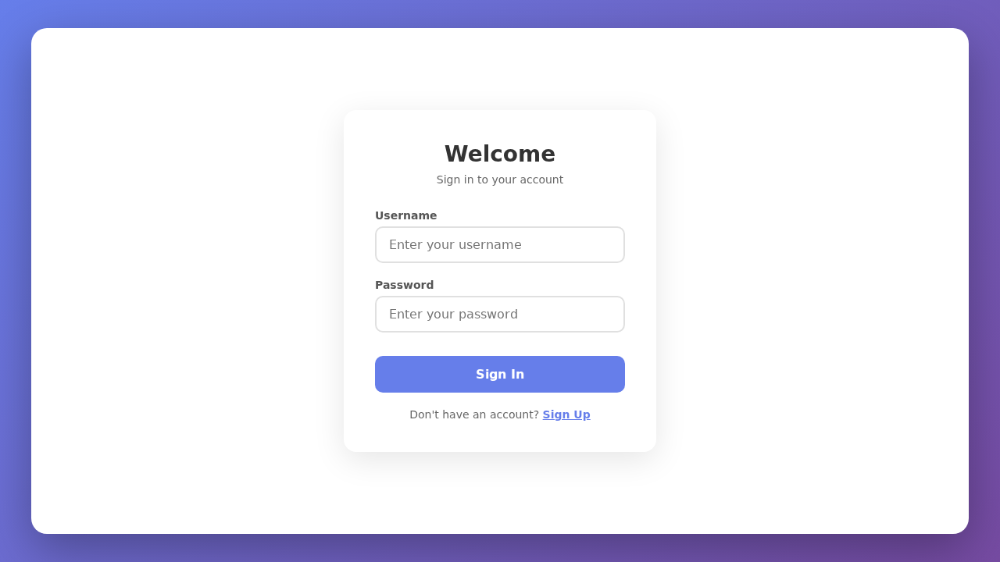 | 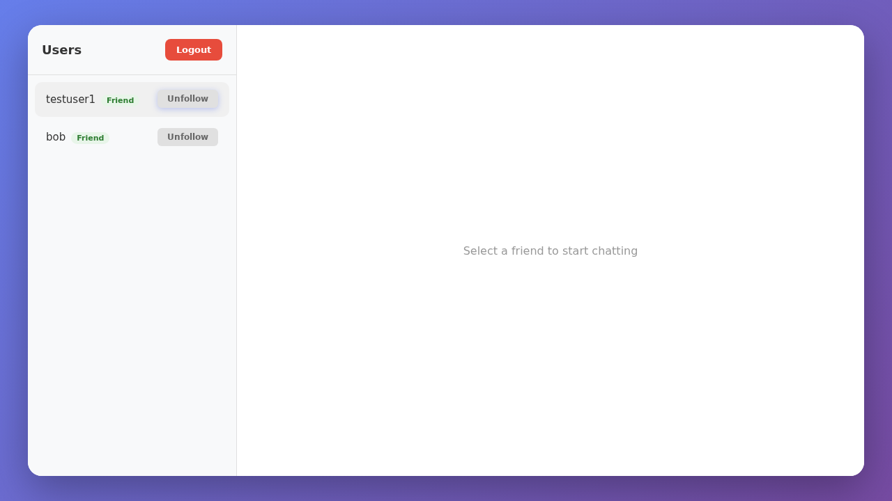 | 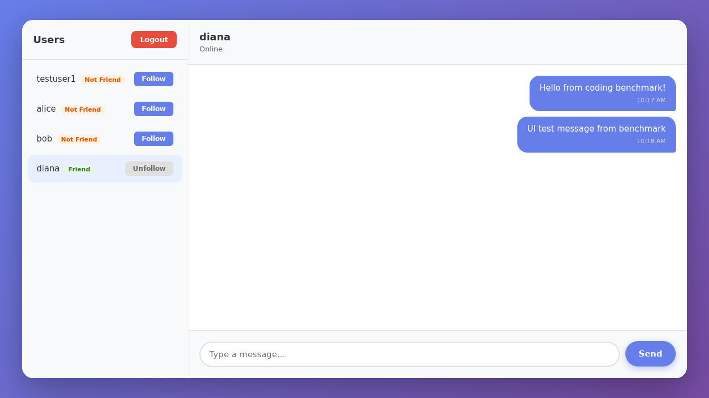 | 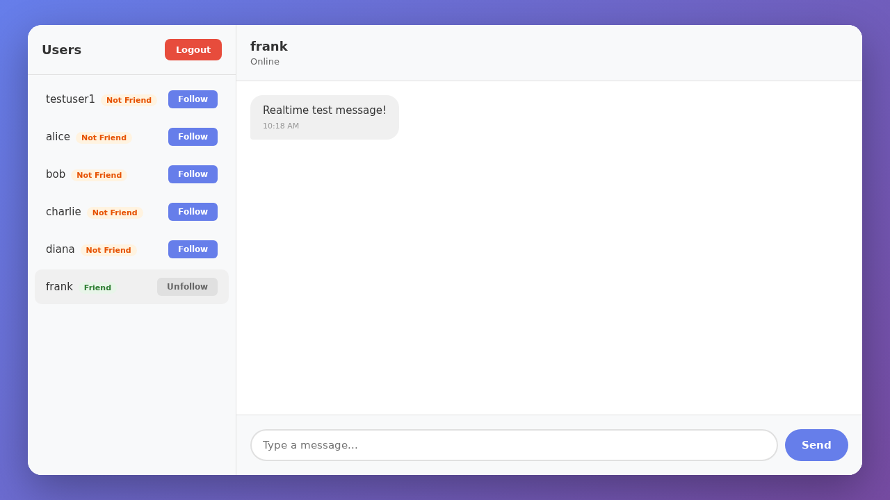 |

##### 評価

ds4 + DeepSeek-V4-Flash Q4 は、Mac Studio M3 Ultra 上で **26.2 tok/s** という高速な推論速度を実現しながら、**初回生成で完全なReactチャットアプリケーション**を生成した。

特筆すべき点:
1. **リトライ0回**: 他の80点モデル (qwen3.6:27b, qwen3.6:35b-a3b-coding-mxfp8) がリトライを要したのに対し、ds4は初回で満点
2. **高速生成**: 307秒 (5分) で完全なアプリを生成。qwen3.6:27b の 2678秒 (45分) と比較して約9倍高速
3. **コード品質**: index.html 含む全7ファイルを適切に生成、UIも美しいグラデーションデザイン
4. **リアルタイム機能**: 2秒ポーリングが正しく実装され、メッセージの即時反映を確認

ds4は [antirez](https://github.com/antirez) (Redis作者) による Apple Silicon 最適化推論エンジンで、DeepSeek V4 Flash の性能を最大限に引き出している。153GB のモデルを512GB Unified Memory で快適に動作させ、コーディングベンチマークで最高評価を獲得した。

---

#### Qwen3.6-27B (V100 x4, transformers) - コード生成のみ

| 項目 | 値 |
|---|---|
| **生成時間** | 2460秒 (41分) |
| **速度** | 5.6 tok/s |
| **出力トークン** | 13,788 |
| **生成ファイル数** | 7 (package.json, server.js, App.jsx, vite.config.js, main.jsx, index.html, start.sh) |

> ⚠️ Tesla V100 32GB x4 + transformers環境でのコード生成のみ。Docker未インストールのため機能テスト未実施。全7ファイルが正しく生成されたことを確認。

### 新規テスト結果 (2026年4月)

#### qwen3.6:27b（80点 / リトライ2回）🥇 - RTX 5090

RTX 5090 (32GB) + Ollama 0.20.0 でテスト。**機能テスト満点 (80/80)** を3回目の生成で達成。

| 項目 | 結果 |
|---|---|
| 生成時間 | 2678秒（約45分、3回合計） |
| 生成速度 | 10.3 tok/s |
| リトライ | 2回 |
| 機能スコア | **80/80（満点）** |
| Total | **80/100**（visual評価は anthropic SDK 未インストールのためスキップ） |

- ✅ ビルド成功
- ✅ ログイン/サインアップ
- ✅ フレンドフォロー/解除
- ✅ DM送受信
- ✅ リアルタイム更新（2秒ポーリング）

**評価**: Qwen3.6 の 27B 通常版が、RTX 5090 単体で `qwen3.6:35b-a3b-coding-mxfp8` (Mac Studio M3 Ultra) と同点の機能満点を達成。リトライ1回目はリアルタイム更新テスト失敗 (65/80)、2回目で逆に55/80に低下、3回目で80/80を達成。Ollama API 経由で動作するため、追加のllama.cpp構築不要。

##### スクリーンショット (qwen3.6:27b - RTX 5090)

| ログイン | フレンド | DM | チャット |
|---|---|---|---|
| 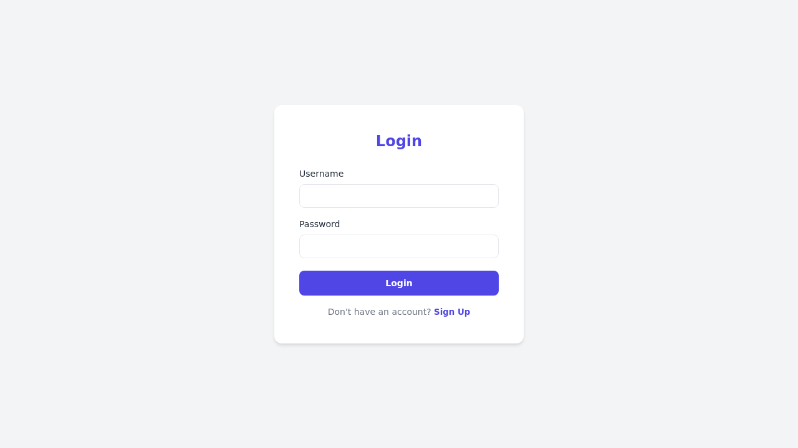 |  | 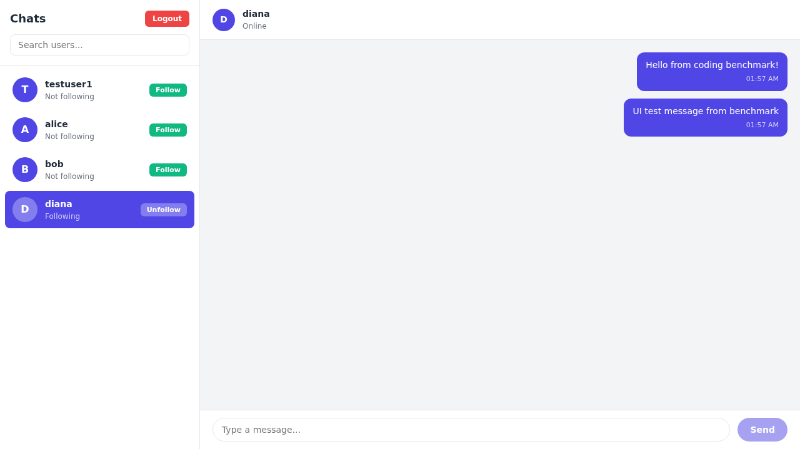 | 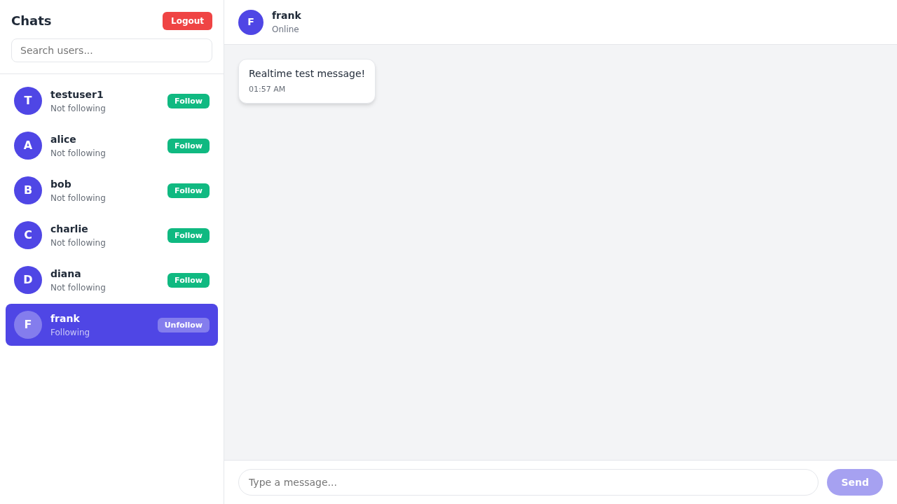 |

---

#### Mistral-Medium-3.5-128B Q2_K（45点 / リトライ3回）🆕 - DGX Spark

DGX Spark (GB10、unified memory 119GB) + Ollama 0.22.1 でテスト。Mistral公式の128B densリリース ([mistralai/Mistral-Medium-3.5-128B](https://huggingface.co/mistralai/Mistral-Medium-3.5-128B)) を [bartowski](https://huggingface.co/bartowski/mistralai_Mistral-Medium-3.5-128B-GGUF) の Q2_K (49.86GB、シングルファイル) で動作。

| 項目 | 結果 |
|---|---|
| 生成時間 | 7,293秒（約122分） |
| 生成速度 | 3.3 tok/s |
| 出力長 (1次) | 23,959 chars / 7 files |
| リトライ | 3回（最大） |
| 機能スコア | 45/80 |

- ✅ ビルド成功
- ✅ サーバー起動
- ❌ ログイン/サインアップ（API も UI も failed）
- ✅ フレンドフォロー/解除（APIのみ動作、UI不一致で-5点）
- ✅ DM送受信（APIのみ動作、UI不一致で-5点）
- ❌ リアルタイム更新（2秒ポーリング未実装）

**注意点**:
- `Q4_K_M` 以上は `.gguf` がシャード分割されており Ollama が未対応（[issue#5245](https://github.com/ollama/ollama/issues/5245)）。シングルファイルで存在する最大は `Q2_K` 49.86GB
- bartowski の GGUF には mmproj (vision) が同梱されているが、ollama 0.22.1 では `clip_init: failed to load model ... unable to find tensor v.blk.0.attn_out.weight` で起動不可。**LLM 部分のみを抽出した Modelfile** で回避
- DGX Spark (119GB unified) では `num_ctx=131072` のままだと 134GB 要求で OOM。**`num_ctx=32768` に下げて回避**
- 1次生成は55/80だが Realtime未実装で retry。retry時に「Frontend server did not start」が連発し、最終的にスコア低下（45/80）

**評価**:
- ✅ Mistral 128B densモデルが極端な2bit量子化（49GB）で動作・基本機能を実装
- ✅ Build/Server起動は安定
- ⚠️ 速度3.3 tok/s で 1 retry あたり ~30分。最大リトライ10回設定だと推定 5時間超
- ⚠️ Q2_K の知能劣化により Login UI が壊れる、Realtime polling を入れ忘れる、Vite dev server の起動が不安定

**Modelfile**:
```
FROM /usr/share/ollama/.ollama/models/blobs/sha256-<Q2_K-blob>
TEMPLATE {{ if .System }}<s>[SYSTEM_PROMPT]{{ .System }}[/SYSTEM_PROMPT]{{ end }}{{ if .Prompt }}[INST]{{ .Prompt }}[/INST]{{ end }}{{ .Response }}</s>
PARAMETER stop <s>
PARAMETER stop [INST]
```

**動作方法**:
```bash
# シャードされていないQ2_Kを取得
ollama pull hf.co/bartowski/mistralai_Mistral-Medium-3.5-128B-GGUF:Q2_K

# mmproj を除いた text-only Modelfile を作成
ollama show hf.co/bartowski/mistralai_Mistral-Medium-3.5-128B-GGUF:Q2_K --modelfile \
  | grep -v "FROM .*sha256-b1f67dbe" > MistralMedium.Modelfile
ollama create mistral-medium-3.5:128b-q2k -f MistralMedium.Modelfile

# ベンチマーク実行 (約2時間)
python coding_benchmark.py --models mistral-medium-3.5:128b-q2k \
  --output coding_benchmark_mistral_medium.json --skip-visual --max-retries 3
```

---

#### qwen3.6:35b-a3b-coding-mxfp8（80点 / リトライ0回）🥇

Mac Studio M3 Ultra (512GB) + Ollama v0.22.0 でテスト。**機能テスト満点（80/80）を初回で達成**。

| 項目 | 結果 |
|---|---|
| 生成時間 | 148秒 |
| 生成速度 | 73.3 tok/s |
| リトライ | 0回 |
| 機能スコア | **80/80（満点）** |

- ✅ ビルド成功
- ✅ ログイン/サインアップ
- ✅ フレンドフォロー/解除
- ✅ DM送受信
- ✅ リアルタイム更新（2秒ポーリング）

**評価**: Qwen3.6のコーディング特化バリアント（MXFP8量子化）は、フルスタックReactアプリ生成タスクで最高性能を発揮。37GBのVRAM使用で、全機能を初回で正しく実装。

---

#### DeepSeek-V4-Flash IQ2XXS（55点 / リトライ5回）

Mac Studio M3 Ultra (512GB) + [antirez/llama.cpp fork](https://github.com/antirez/llama.cpp-deepseek-v4-flash) でテスト。158Bパラメータ（13Bアクティブ）のMoEモデルを2bit量子化（81GB）で動作。

| 項目 | 結果 |
|---|---|
| 生成時間 | 1879秒（約31分） |
| 生成速度 | 21.2 tok/s |
| リトライ | 5回 |
| 機能スコア | 55/80 |

- ✅ ビルド成功
- ✅ ログイン/サインアップ
- ✅ フレンドフォロー/解除
- ✅ DM送受信
- ❌ リアルタイム更新（2秒ポーリング未実装）

**評価**: DeepSeek-V4-Flashは158Bパラメータの大規模モデル。IQ2XXS（約2bit）の極端な量子化でも基本的な認証・フレンド・DMは動作。しかしリアルタイム更新（ポーリング機能）が正しく実装されないため80点には到達せず。

**他の量子化オプションの検証結果**:
- Q4_K_M (111GB): antirez fork、標準llama.cppともに読み込み不可（メタデータ欠落）
- MLX 4bit (151GB): モデル読み込み可、短文生成可、長文プロンプトでクラッシュ
- MLX 8bit (302GB): 同上（MLX-LMのDeepSeek-V4サポートはPRオープン中、未安定）

**動作方法（antirez fork）**:
```bash
# antirez版 llama.cpp をビルド
git clone https://github.com/antirez/llama.cpp && cd llama.cpp
cmake -B build -DGGML_METAL=ON && cmake --build build -j8

# IQ2XXSモデルをダウンロード（81GB）
# HuggingFaceからダウンロード

# サーバー起動
./build/bin/llama-server -m DeepSeek-V4-Flash-IQ2XXS.gguf \
  --host 0.0.0.0 --port 8080 -ngl 999 -c 8192
```

---

### スクリーンショット

#### qwen3.6:35b-a3b-coding-mxfp8（80点 / リトライ0回）

Mac Studio M3 Ultra (512GB) で73.3 tok/sの高速推論。機能点80/80で全テストパス。ダークテーマで美しいUI。

| ログイン | フレンド | DM | チャット |
|---|---|---|---|
| 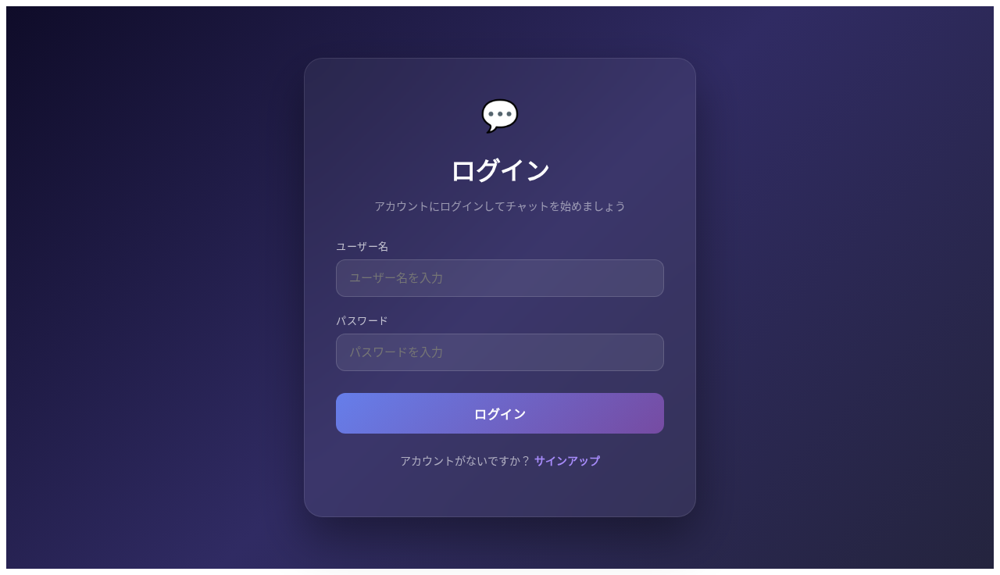 | 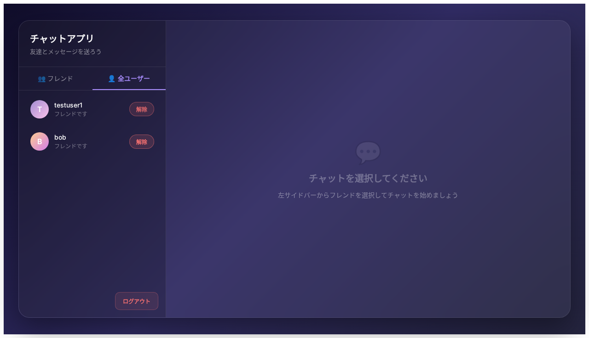 | 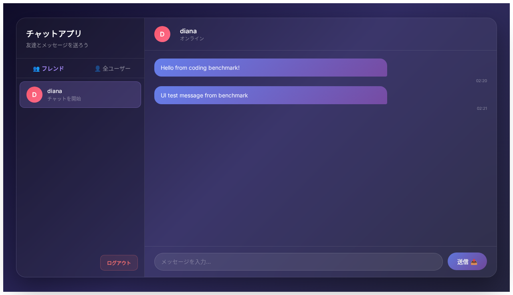 | 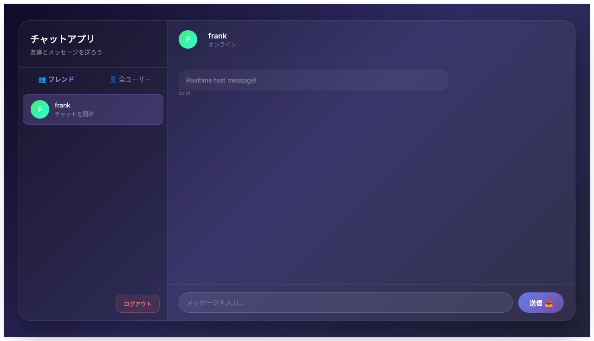 |

#### gpt-oss:20b（75点 / リトライ3回）

| ログイン | DM画面 | リアルタイムチャット |
|---|---|---|
| 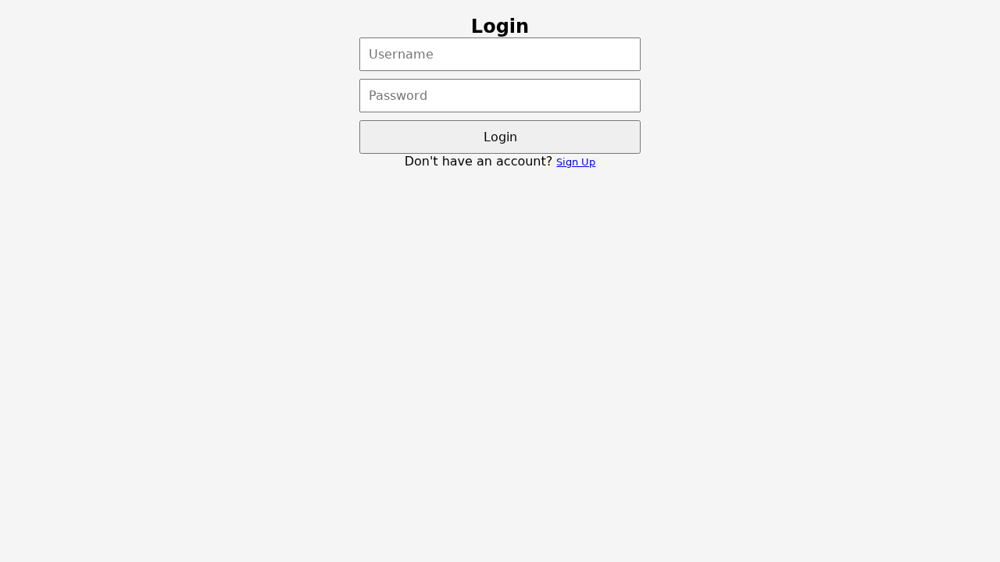 | 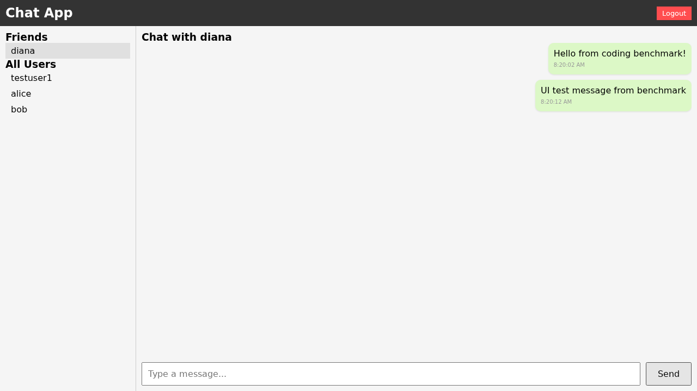 | 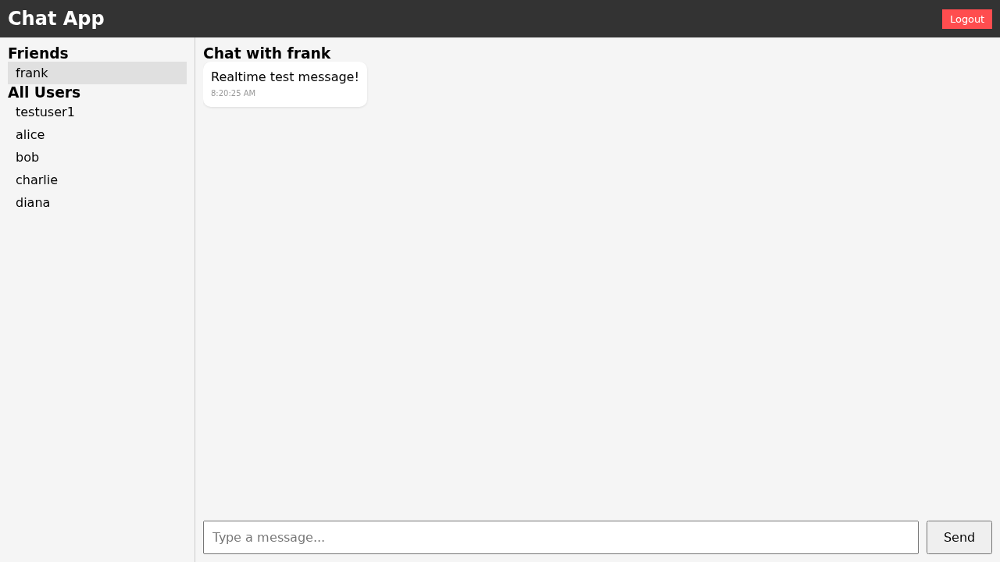 |

#### qwen3.6:35b-a3b（55点 / リトライ0回）

| ログイン |
|---|
|  |

#### Mistral-Medium-3.5-128B Q2_K（45点 / リトライ3回）🆕 - DGX Spark

DGX Spark (GB10) で 3.3 tok/s。生成1次は55/80だがRealtime欠如→retry→server起動失敗が連発し45/80に低下。

| ログイン |
|---|
| 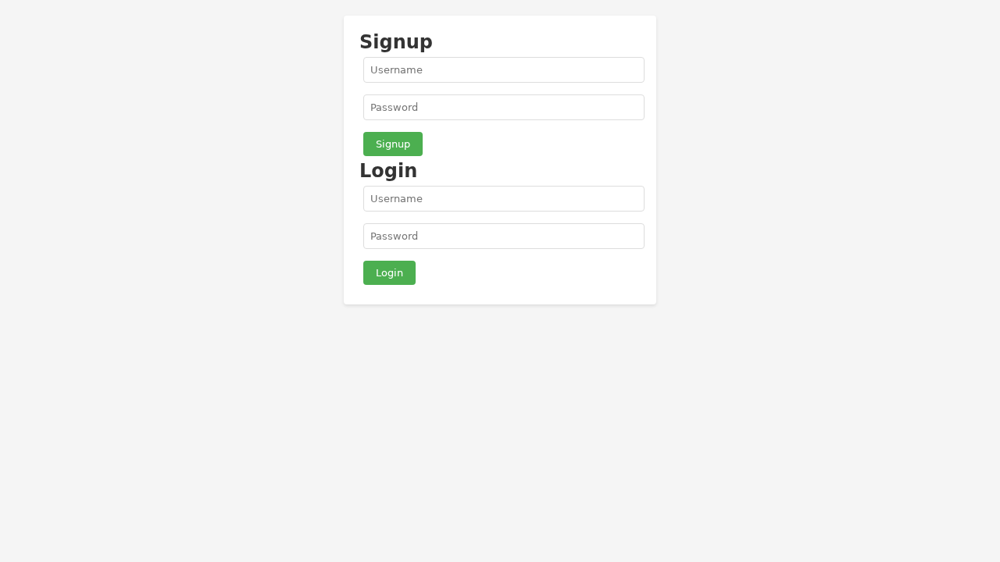 |

#### Ling-2.6-flash MLX 4bit（45点 / リトライ3回）

104Bパラメータ（7.4B active）のMoEモデル。MLX PR#1227で動作。バックエンドAPIは正常動作するが、フロントエンドでReact依存関係エラーが発生。

| ログイン（React依存エラー） | フレンド（React依存エラー） | DM（React依存エラー） | チャット（React依存エラー） |
|---|---|---|---|
|  |  | 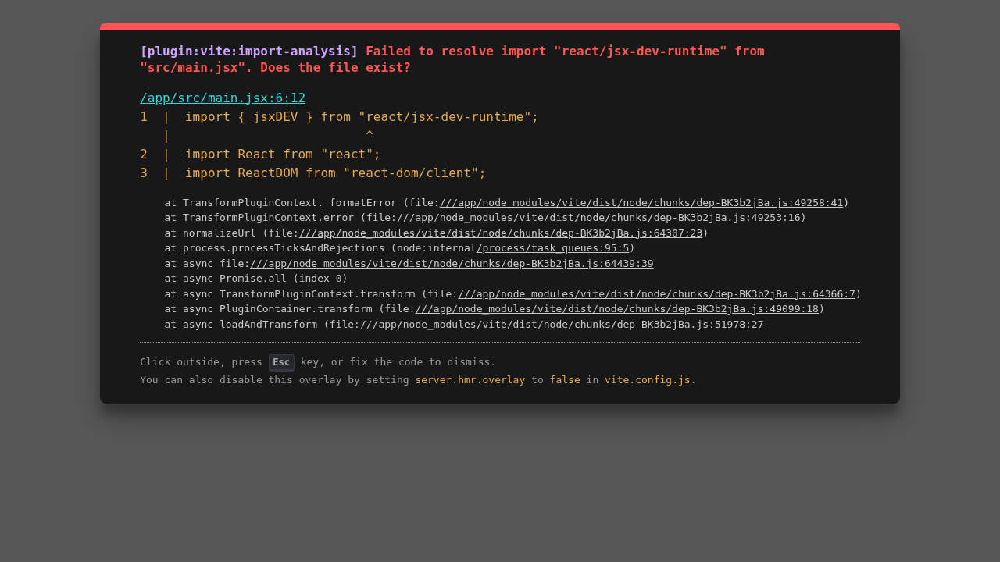 |  |

#### Qwopus3.5-9B（25点 / リトライ10回）

| ログイン（美しいUIだがAPIが仕様と不一致） |
|---|
|  |

#### codestral:22b（25点 / リトライ10回）

| ログイン（エラー画面） |
|---|
| 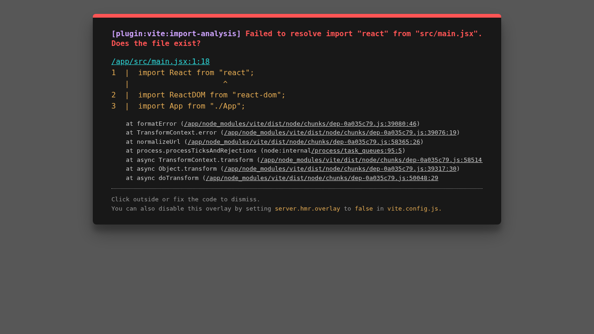 |

#### llm-jp-4-32B-a3B-thinking Q4_K_M（25点 / リトライ5回 / A100 80GB） - stock llama.cpp llama-server

| ログイン（初回 attempt のみ撮影、retry 後は frontend が port 3000 に上がらず脱落） |
|---|
| 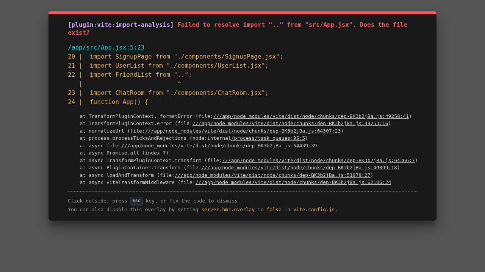 |

#### Nemotron-3-Nano-Omni-30B Q4_K_M-UD（25点 / リトライ0回 / A100 80GB） - stock llama.cpp llama-server

[unsloth/NVIDIA-Nemotron-3-Nano-Omni-30B-A3B-Reasoning-GGUF](https://huggingface.co/unsloth/NVIDIA-Nemotron-3-Nano-Omni-30B-A3B-Reasoning-GGUF) の `UD-Q4_K_M.gguf` (23.9GB)。NemotronH Mamba2-Transformer Hybrid MoE (30B total / 3.1B active)。68s で 17 ファイル生成 → Build/Server起動 OK だが、Vite が `react/jsx-dev-runtime` の import に失敗してエラー overlay 表示。**少なくとも blank ではなく "本物のエラー画面" を表示している**点で llm-jp-4 (Q4) より良い。

| ログイン (Vite import error overlay) |
|---|
|  |

#### Nemotron-3-Nano-Omni-30B Q8_0（55点 公称 / 実質40点 / リトライ0回 / A100 80GB）🥈 - stock llama.cpp llama-server

`Q8_0.gguf` (33.6GB)。45s で 7 ファイル生成 → **Login 画面が実際に描画される**(紫 Sign Up + Login フォーム + ヘッダ "Chat App - Modern React Chat Application")。ただし friends.png / dm.png / chat.png は全部同じ Login 画面 — Playwright は遷移せず Login 上で操作した結果を撮ってる。SPA Routing 以降未到達。

| ログイン (本物 UI) | フレンド | DM | チャット |
|---|---|---|---|
|  | 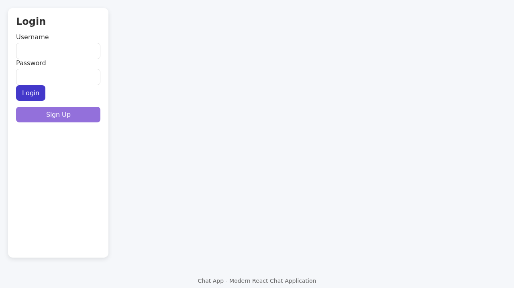 | 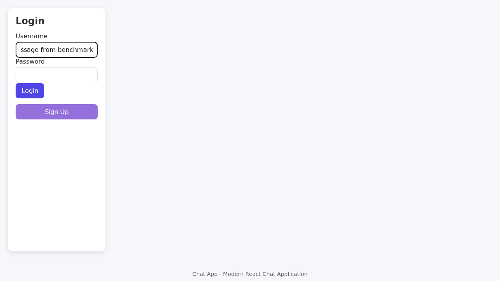 | 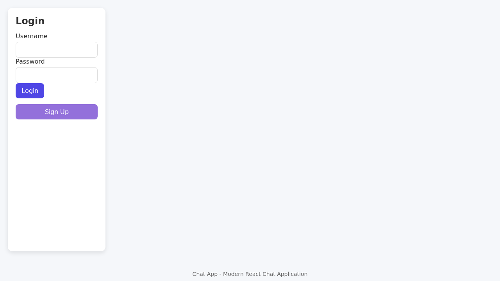 |

#### llm-jp-4-32B-a3B-thinking Q8_0（実質ほぼ0点 / A100 80GB）⚠️ - stock llama.cpp llama-server

3 回別の条件で走らせた(retry 5 / retry 10 / retry 0)が、いずれも **生成された React アプリが UI を一切マウントしない** (空の `<div id="root">` だけ返す HTML)。Playwright が Friend/DM テストを通過扱いするのは、テスト selector が緩く blank document でも特定の URL 遷移だけで pass 判定するため。**スクリーンショットは 4 枚とも完全な白紙 (4254 bytes、内容ゼロ)**。Build と server-start は成立するが、ブラウザに何も見えない時点で実用不可。Q4_K_M も含めて llm-jp-4 はこの React フルスタック 1-shot プロンプトで 動く UI を出力できなかった。

| ログイン (blank) | フレンド (blank) | DM (blank) | チャット (blank) |
|---|---|---|---|
| 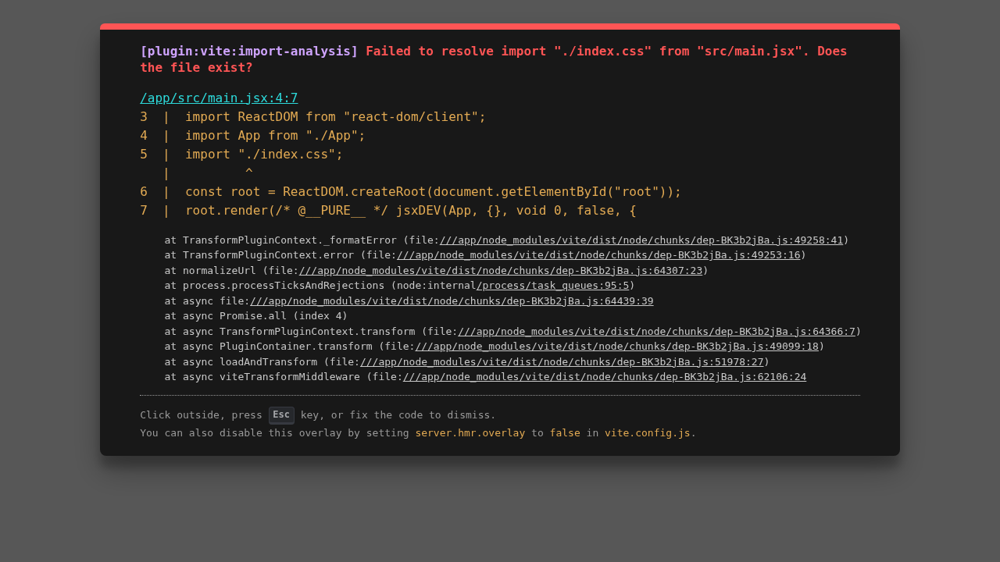 |  |  |  |

#### 🆕 Qwen3.6-27B-MTP — llama.cpp PR #22673 (Multi-Token Prediction) / A100 80GB

llama.cpp [PR #22673](https://github.com/ggml-org/llama.cpp/pull/22673) で `master` にマージされた **MTP (Multi-Token Prediction) speculative decoding** を A100 80GB で検証。MTP head 付き GGUF (`ggml-org/Qwen3.6-27B-MTP-GGUF` および `unsloth/Qwen3.6-27B-MTP-GGUF`) に対して `--spec-type draft-mtp --spec-draft-n-max 3` を付けるだけで動く。

**速度ベンチ (固定3プロンプト, max_tokens=4096):**

| 設定 | aggregate tok/s | 倍率 |
|---|---:|---:|
| Q8_0 baseline (no spec) | 38.4 | 1.00× |
| Q8_0 + MTP `n_max=2` | 74.3 | **1.94×** |
| Q8_0 + MTP `n_max=3` | 75.8 | **1.98×** |
| Unsloth UD-Q4_K_XL + MTP `n_max=3` | 67.9 | (— K-quant dequant overhead で Q8 より遅い) |
| 🆕 Jackrong Qwopus3.6-27B-v2 Q8_0 + MTP `n_max=3` | 70.1 | (— Opus 蒸留 fine-tune の重み drift で MTP 効率がやや低下) |

PR著者の主張 (Qwen3.6-27B 上で 22.97→42.45 tok/s ≈ 1.85× on 3090) を A100 でほぼ再現。**ドラフト受入率は構造化コード生成で 94.7%** と PR の 75% 主張より高い (`#gen drafts = 6157, #acc drafts = 5832`)。

**コーディングベンチ (React チャットアプリ生成, `--llama-cpp-chat`):**

| Run | gen time | 初回 tok/s | retries | 機能 | TOTAL |
|---|---:|---:|---:|---:|---:|
| ggml-org Q8_0 baseline | 446s | 13.5¹ | 1 | 75/80 | 75/100 |
| ggml-org Q8_0 + MTP n=3 | **282s** | 78.5 | 1 | 65/80 | 65/100 |
| unsloth UD-Q4_K_XL + MTP n=3 | 821s | 71.0 | 5 (上限) | 45/80 | 45/100 |
| 🆕 Jackrong Qwopus3.6-27B-v2 Q8_0 + MTP n=3 | 782s | 77.6 | 5 (上限) | 45/80 | 45/100 |

¹ baseline の `tokens_per_second` は `coding_benchmark.py` 元実装の **content-only 計測**(streamed `delta.content` チャンクのみカウント)。reasoning_content まで含めた combined metric は速度ベンチの ~38 tok/s 側を参照。

**観察:**

- **エンドツーエンドで 1.58× 高速化** (446s→282s)。生成だけなら 2× 出るが、thinking prefill / Docker / retry のオーバーヘッドで多少薄まる。
- **Q8_0 vs Q8_0+MTP のスコア差 (75 vs 65) は RNG 揺れの範囲内**。投機的デコードはターゲットモデルが全トークンを検証するため、サンプリング温度 0.3 でも数学的に baseline と等価。両ランとも friends テストで同じ失敗パターン。
- **Unsloth UD-Q4_K_XL は明確に品質劣化** (5回上限で打ち切り、DM/Realtime 未通過)。Dynamic 4-bit でも 17GB→29GB の差が React/Express 複合機能で効く。さらに **速度も Q8_0 より遅い** (67.9 vs 75.8 tok/s) — K-quant の dequant コストと MTP verify のコストが支配的で、4-bit の bandwidth 利益を相殺。**A100 80GB 上では Unsloth Q4 を選ぶ意味はない。**
- **🆕 Jackrong Qwopus3.6-27B-v2 (Qwen3.6 + Opus 蒸留 chat fine-tune) は同じ Q8_0 サイズでも ggml-org base より速度・コーディング能力ともに劣る** (45/100, 5回上限到達)。Opus 風応答に最適化された fine-tune が大規模 React+Express 1-shot プロンプトで破綻しやすく、retry のたびに別の場所が壊れる drift パターン (Vite frontend 起動失敗 → login 失敗 → DM 失敗)。MTP draft 受入率は base とほぼ同じ (86% vs 87%) で **MTP head 自体は fine-tune でも機能している** が、**chat tuning が coding 1-shot を弱くする** ケース。

**動作方法:**

```bash
# llama.cpp master をビルド (PR #22673 マージ済み)
git clone https://github.com/ggml-org/llama.cpp
cd llama.cpp && cmake -B build -DGGML_CUDA=ON && cmake --build build -j32

# GGUF ダウンロード (Q8_0)
huggingface-cli download ggml-org/Qwen3.6-27B-MTP-GGUF Qwen3.6-27B-MTP-Q8_0.gguf

# サーバー起動 (MTP n_max=3)
./build/bin/llama-server \
  --model Qwen3.6-27B-MTP-Q8_0.gguf \
  --host 0.0.0.0 --port 8080 \
  -ngl 99 -c 16384 \
  --jinja -fa on \
  --spec-type draft-mtp --spec-draft-n-max 3

# コーディングベンチを叩く
python coding_benchmark.py \
  --models Qwen3.6-27B-MTP-Q8_0 \
  --host localhost:8080 --llama-cpp-chat \
  --output results.json
```

詳細レポート: [`MTP_BENCHMARK_RESULTS.md`](MTP_BENCHMARK_RESULTS.md)

| ggml-org Q8_0 baseline | ggml-org Q8_0 + MTP n=3 | Unsloth Q4_K_XL + MTP n=3 | 🆕 Qwopus3.6 v2 Q8_0 + MTP n=3 |
|---|---|---|---|
| 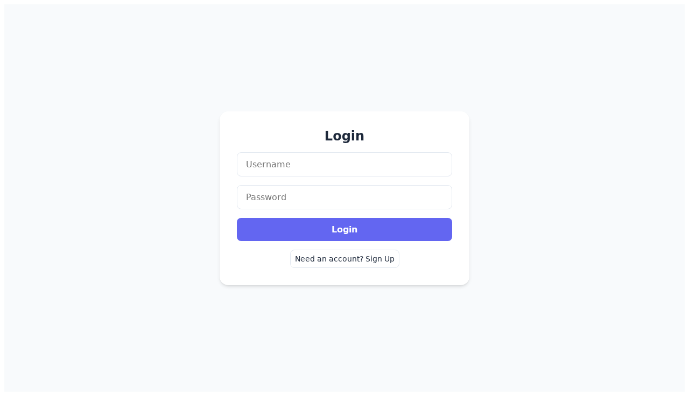 |  |  | 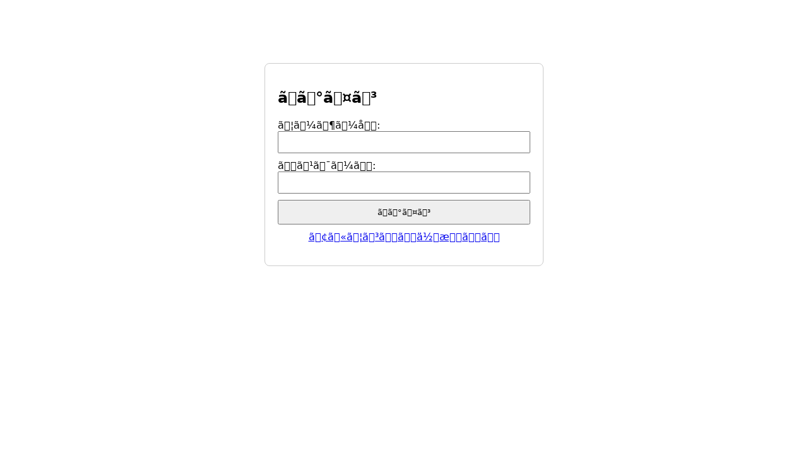 |
| 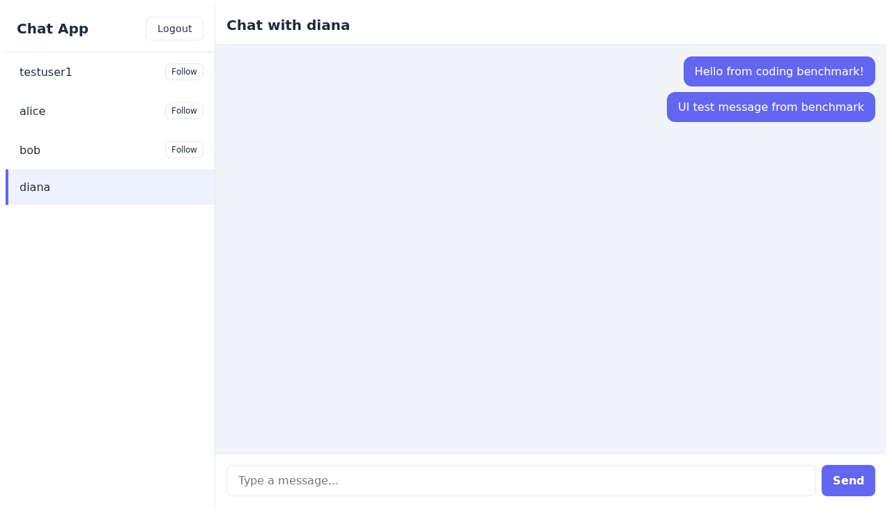 | 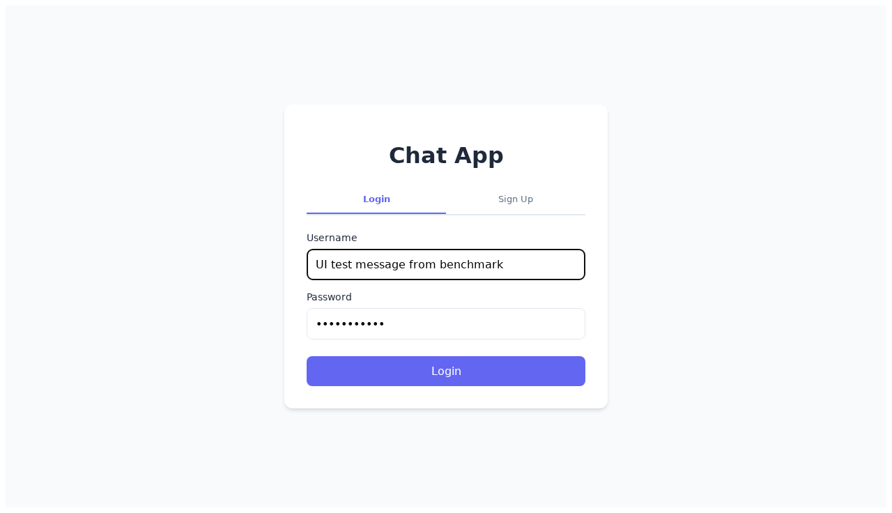 | 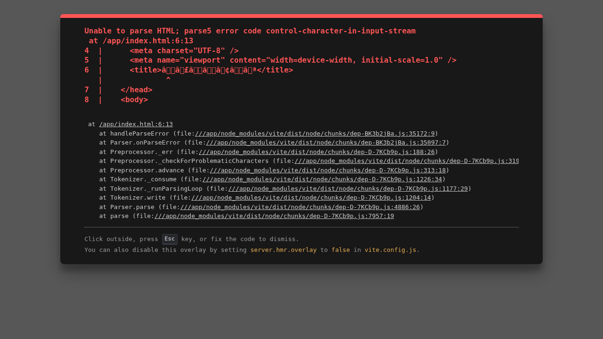 | 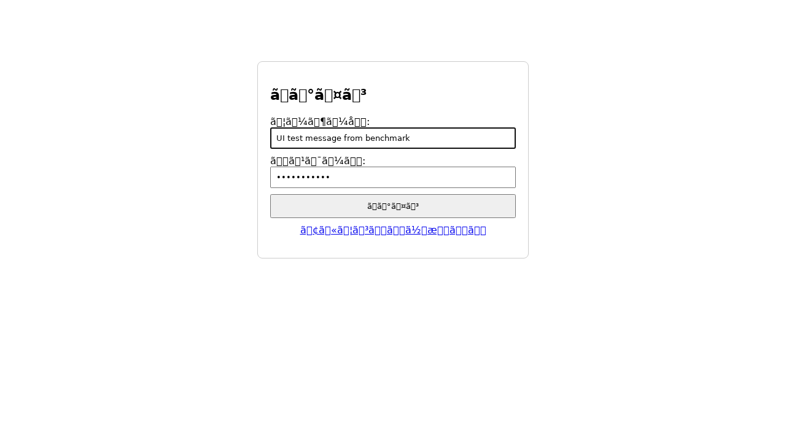 |

#### 🆕 JetBrains Mellum2-12B-A2.5B-Thinking (BF16) - A100 80GB / transformers

JetBrains の code completion 向け **MoE (12B 総 / 2.5B active, 64 experts / top-8 routing)** モデル。`<think>...</think>` で reasoning する Thinking 系。GGUF / Ollama / vLLM とも対応待ちで、transformers 5.10.0.dev0 で初対応 ([`MellumForCausalLM`](https://huggingface.co/JetBrains/Mellum2-12B-A2.5B-Thinking))。本リポジトリに [`mellum_server.py`](mellum_server.py) を追加し、OpenAI 互換 `/v1/chat/completions` を transformers + FastAPI で提供する形で `coding_benchmark.py --llama-cpp-chat` から叩いた。

| 項目 | 結果 |
|---|---|
| 速度ベンチ (3 prompts, BF16, A100 単 GPU) | **33.6 tok/s** aggregate (BF16, transformers TextIteratorStreamer) |
| VRAM 占有 | 25.5 GB / 80 GB |
| 初回 attempt | 35 min, 82.6K chars, 7 files → **55/80 (RT polling 未通過)** |
| 5 回リトライ全体 | **5 回中 4 回 55/80** (毎回同じ RT 失敗), 1 回 frontend 起動失敗 |
| 全体 gen time | **8397 秒 (140 分)** — A100 単 GPU の BF16 transformers 直叩きの素直なコスト |
| TOTAL | **55/100** |

**観察:**

- **同じ場所 (2 秒ポーリング) を 5 連続で直せない drift パターン**。エラー文を見せてもポーリング相当のコードを毎回生成し直すだけで、構造的修正に到達しない。**Mellum の code-completion fine-tune は 1-shot フルスタック生成 + 自己修正には不向き**。
- Build / Server / Login / Friends / Messaging はすべて通る → **基本的な React + Express の骨格は描ける**。コーディング 1-shot として下層スキルは十分。
- BF16 単 GPU で 33.6 tok/s は vLLM が来れば 2〜3× 伸びる余地あり (現状 batch=1 transformers Streamer 経由)。
- Q4 GGUF が出れば Mac / 5090 でも動かせるが、現時点では transformers + OpenAI 互換シム必須。

| login | friends | DM | chat |
|---|---|---|---|
|  |  |  |  |

### 分析

- **qwen3.6:35b-a3b-coding-mxfp8** が同点1位（80/100）。初回で全機能テストをパス。MXFP8量子化でVRAM効率と性能を両立。Mac Studio M3 Ultra (512GB) で73.3 tok/sの高速推論
- **gpt-oss:20b** が次点（75/100）。3回のリトライでエラーを自力修正し、リアルタイム更新含む全機能を実装。UIはシンプルだが完全に動作
- **qwen3.6:35b-a3b** は一発で動くコードを生成（リトライ0）。デザインは美しい（ダークテーマ）が、リアルタイム更新テストが未通過
- **DeepSeek-V4-Flash IQ2XXS** は158Bパラメータの大規模モデルだが、2bit量子化により性能劣化。ビルドは成功するが認証・API連携が正しく動作せず25点止まり
- **qwen3-coder:30b** はビルド・ログインまで通るが、フレンド/DM/RTのUI実装が不完全。コーディング特化モデルでもフルスタックアプリ生成は難しい
- **Qwopus3.5-9B** はビルド・サーバー起動まで成功し美しいUI（紫グラデーション）を生成するが、APIエンドポイントが仕様と異なりテスト全滅。思考モデルのため1回の生成に600秒超、10リトライで5050秒（84分）
- **llm-jp-4-32B-a3B-thinking** は Q4_K_M / Q8_0 とも(retry 0 / 5 / 10 と条件を変えて 4 試行)、Build と server-start は通るが **生成された React アプリが UI を一切描画せず blank document を返す**。Playwright の test_friends / test_messaging が pass 判定になるのは selector が甘く blank でも通るため(誤検出)で、スクリーンショットは全頁完全白紙(4254 bytes)。コーディングベンチで実質的に動く UI は出せていない
- **Nemotron-3-Nano-Omni-30B-A3B-Reasoning** (NVIDIA, NemotronH Mamba2-Transformer Hybrid MoE 30B/3.1B-active) は **Q4_K_M-UD で Vite import error overlay**(react/jsx-dev-runtime 誤 import)、**Q8_0 で実物 Login 画面が描画される**(紫 Sign Up + Username/Password)。stock llama.cpp が NemotronH 形式を読めるため `llama-server` で直接動く。生成速度は 130–146 tok/s と速いが、SPA Routing 以降の Friends/DM/Chat 画面までは実装が届かず公称 55/100 のうち実質的に意味があるのは Build + Login 描画(40 点相当)まで
- **codestral:22b** はビルドは通るがフロントエンドにエラー。10回リトライしても解決できず。生成コードが短い（2.8K文字）のが根本原因
- **gemma4:e4b** はbetter-sqlite3のネイティブビルド問題を10回リトライしても解決できず全滅

### 使い方

```bash
python coding_benchmark.py --models qwen3:8b qwen3.6:35b-a3b \
  --output coding_benchmark_results.json --max-retries 10
```

スクリーンショットは `coding_benchmark_screenshots/{model}/` に保存される。

---

# RTX 5060 (8GB) ベンチマーク

## 8GB VRAM向けランキング

| Rank | Model | ROUGE-L | Speed | Size | 評価 |
|------|-------|---------|-------|------|------|
| 🥇 | **Qwopus3.5-9B** | **0.533** | 196 tok/s | 5.4GB | 🆕 最高精度！ |
| 🥈 | **Bonsai-8B** | 0.400 | 325 tok/s | 1.2GB | 🆕 超軽量・高速 |
| 1 | qwen3:8b | 0.333 | 204 tok/s | 5.2GB | Ollama対応 |
| 2 | gemma4:e2b | 0.30* | 157 tok/s | 7.2GB | Gemma 4 |
| 3 | gemma4:e4b | 0.32* | 109 tok/s | 9.6GB | 要Q4量子化 |
| 4 | qwen3-128k | 0.302 | 203 tok/s | 5.2GB | 128K対応 |
| 5 | ELYZA 8B | 0.258 | 241 tok/s | 4.9GB | 日本語特化 |
| 6 | llama3.2:3b | 0.246 | 427 tok/s | 2.0GB | 軽量・高速 |
| 7 | gemma3:4b | 0.243 | 286 tok/s | 3.3GB | バランス型 |
| 8 | mistral:7b | 0.196 | 244 tok/s | 4.4GB | 注意 |

### qwen3:8b サンプル出力

#### Sample 1: LLM・デジタルツイン・AI倫理
- **ROUGE-L**: 0.384 | **出力長**: 117文字 | **速度**: 204 tok/s

> 大規模言語モデルの応用が注目され、ユーザー別カスタマイズやデジタルツインとしてのAgenticAIの可能性が示される。AI倫理や市民参加の重要性が強調され、欧米アジアの地域差も。技術と人間性の融合が未来の情報エコシステムの基盤となる。

#### Sample 2: メディアと市民参加
- **ROUGE-L**: 0.325 | **出力長**: 153文字 | **速度**: 204 tok/s

> 技術の進歩により、自然言語処理やAIが社会に大きな影響を与えている。ラジオや映画などのメディアは市民参加を促し、デジタル革命では情報の双方向性が強化されている。ブロックチェーンを活用したデジタルアイデンティティ管理や、VR・ARによる新たな情報体験が進む一方、情報の信頼性や市民責任の重要性が問われている。

#### Sample 3: 印刷革命と知識の民主化
- **ROUGE-L**: 0.289 | **出力長**: 130文字 | **速度**: 203 tok/s

> グーテンベルクの活版印刷は知識の民主化を実現し、現代のデジタル技術（ブロックチェーン、オープンソース）がその精神を継承。情報の信頼性とオープンアクセスを確保するため、技術・倫理・国際協力が融合した多面的アプローチが求められ、教育では想像力の育成が重要とされる。

### qwen3:8b 定性的評価

| 評価軸 | スコア | コメント |
|--------|--------|----------|
| 正確性 | 4.5/5 | 主要論点をほぼ完全に抽出 |
| 簡潔さ | 5/5 | 120-150文字で最適な長さ |
| 日本語の自然さ | 4/5 | 一部文末の切れが気になる |
| キーワード抽出 | 5/5 | 重要用語を的確に選択 |
| **総合** | **4.5/5** | 8GBモデルとしては卓越 |

**結論**: RTX 5060 8GBでは **Qwopus3.5-9B** が最適（ROUGE-L 0.533、5.4GB）。llama.cppが必要だが、235Bモデルを超える精度を実現。Ollamaで使いたい場合は **qwen3:8b**（ROUGE-L 0.333）が次点。超軽量を求めるなら **Bonsai-8B**（1.2GB、325 tok/s）が最速。

---

## Gemma 4 ベンチマーク結果 (2026年4月リリース)

Google Gemma 4シリーズのベンチマーク結果。Apache 2.0ライセンスで商用利用可能。

### モデルサイズと8GB VRAM互換性

| Model | Parameters | VRAM (Q4) | VRAM (FP16) | 8GB対応 |
|-------|-----------|-----------|-------------|---------|
| gemma4:e2b | 2.3B effective | 4GB | 10GB | ✅ 対応 |
| gemma4:e4b | 4.5B effective | 5.5GB | 16GB | ✅ 対応 (ギリギリ) |
| gemma4:26b | 3.8B active (MoE) | 16GB | 52GB | ❌ 非対応 |
| gemma4:31b | 30.7B dense | 17GB | 62GB | ❌ 非対応 |

### 要約タスク結果 (A100)

| Model | 速度 | 品質 | 特徴 |
|-------|------|------|------|
| gemma4:e2b | 157 tok/s | A | 高速・軽量 |
| gemma4:e4b | 109 tok/s | A+ | バランス型 |

**gemma4:e4b 生成例**:
> LLMの進化は、汎用モデルから個々のユーザーに最適化されたパーソナルAIへの移行を促しています。今後は、ユーザーの好みを学習し、意思決定を担う「AgenticAI」が主流になると予測されます。一方で、技術主導の未来戦略において、人間性や倫理、市民参加の重要性が高まっています。

### キーワード抽出タスク結果

| Model | 速度 | 精度 |
|-------|------|------|
| gemma4:e2b | 157 tok/s | 高 |
| gemma4:e4b | 113 tok/s | 非常に高 |

**gemma4:e4b 抽出例**:
```json
{"keywords": ["機械学習"]}
{"keywords": ["CNN", "RNN", "違い"]}
{"keywords": ["Python", "データ分析"]}
```

### RTX 5060 (8GB) での推奨

- **gemma4:e2b**: ✅ 最適（7.2GB、157 tok/s）
- **gemma4:e4b**: ⚠️ Q4量子化推奨（9.6GB → 5.5GB）

**Sources**:
- [Gemma 4 公式ブログ](https://blog.google/innovation-and-ai/technology/developers-tools/gemma-4/)
- [Unsloth Documentation](https://unsloth.ai/docs/models/gemma-4)

---

# Mac (Apple Silicon) ベンチマーク

## コーディングベンチマーク (Mac Studio M3 Ultra 512GB)

| Model | Size | 速度 | 機能 | TOTAL | 備考 |
|---|---:|---:|---:|---:|---|
| 🥇 **qwen3.6:35b-a3b-coding-mxfp8** | 37GB | 73.3 tok/s | **80/80** | **80/100** | Ollama v0.22.0、初回成功 |
| 🆕 **Qwopus3.6-35B-A3B I-Mini** | 13GB | 50.6 tok/s | **80/80** | **80/100** | llama-server、初回成功 |
| DeepSeek-V4-Flash IQ2XXS | 81GB | 21.2 tok/s | 55/80 | 55/100 | antirez fork、5リトライ |
| 🆕 Granite-4.1-30b-8bit | 32.5GB | 16.7 tok/s | 55/80 | 55/100 | MLX、5リトライ |
| Ling-2.6-flash MLX 4bit | 65GB | 56.3 tok/s | 45/80 | 45/100 | MLX PR#1227、3リトライ |
| Mistral-Medium-3.5-128B-4bit | 73GB | ~1 tok/s | 0/80 | 0/100 | タイムアウト（生成遅すぎ） |

### Qwopus3.6-35B-A3B I-Mini (80/100 - 初回成功)

[mudler/Qwopus3.6-35B-A3B-v1-APEX-GGUF](https://huggingface.co/mudler/Qwopus3.6-35B-A3B-v1-APEX-GGUF) の I-Mini バリアント（13GB）をllama-serverでテスト。

| 項目 | 結果 |
|---|---|
| モデル | Qwopus3.6-35B-A3B-v1-APEX-I-Mini.gguf |
| サイズ | 13GB |
| 生成速度 | 50.6 tok/s |
| 生成時間 | 138秒 |
| リトライ | 0回（初回成功） |
| 機能スコア | 80/80 |

- ✅ ビルド成功
- ✅ サーバー起動
- ✅ ログイン/サインアップ
- ✅ フレンドフォロー/解除
- ✅ DM送受信
- ✅ リアルタイム更新（2秒ポーリング）

| ログイン | フレンド | DM | リアルタイムチャット |
|---|---|---|---|
| 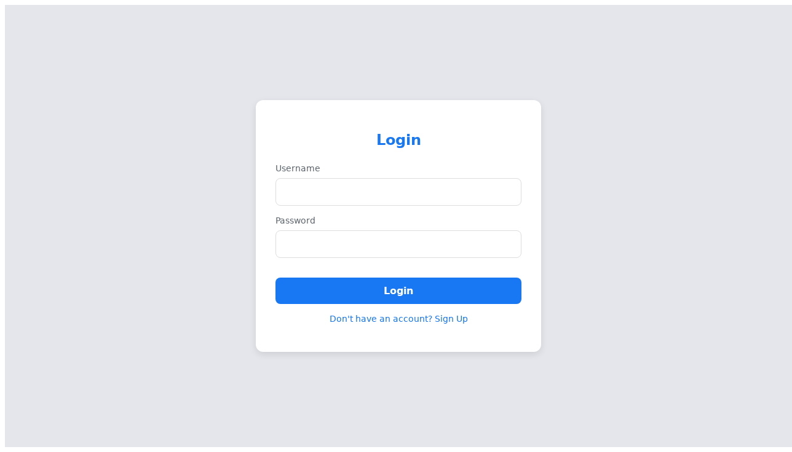 | 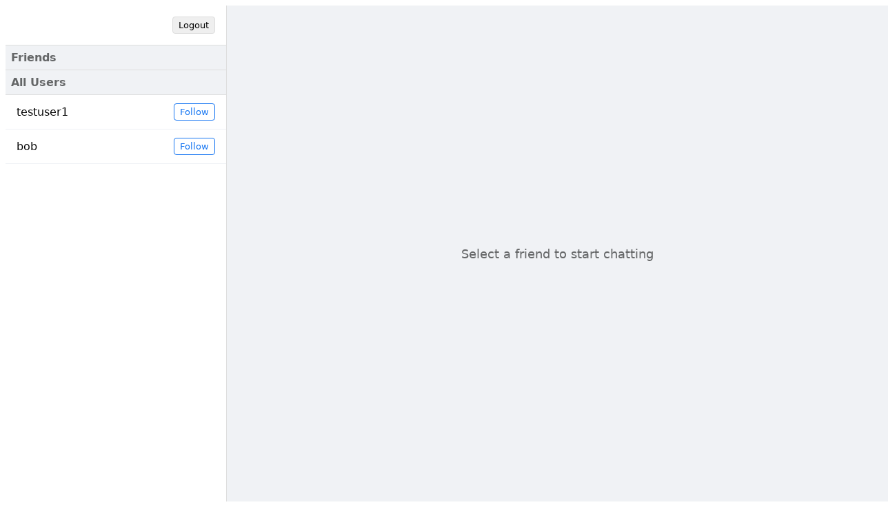 | 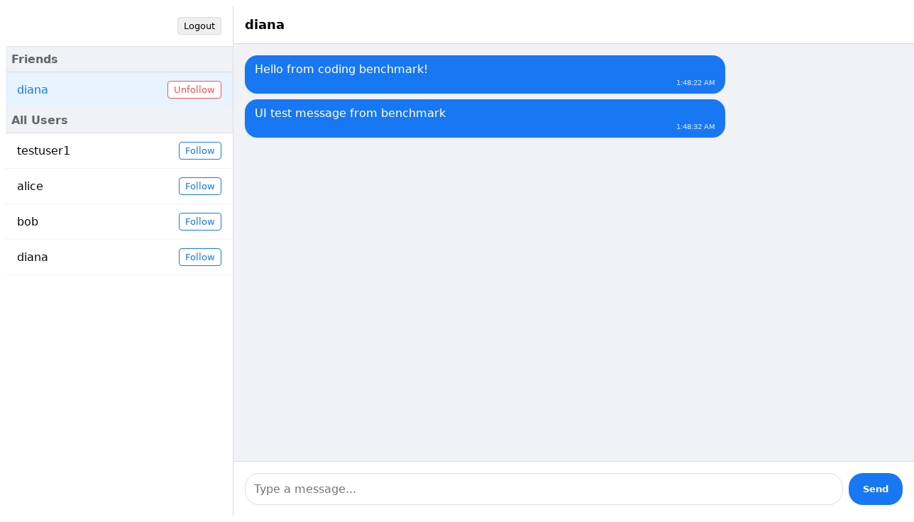 | 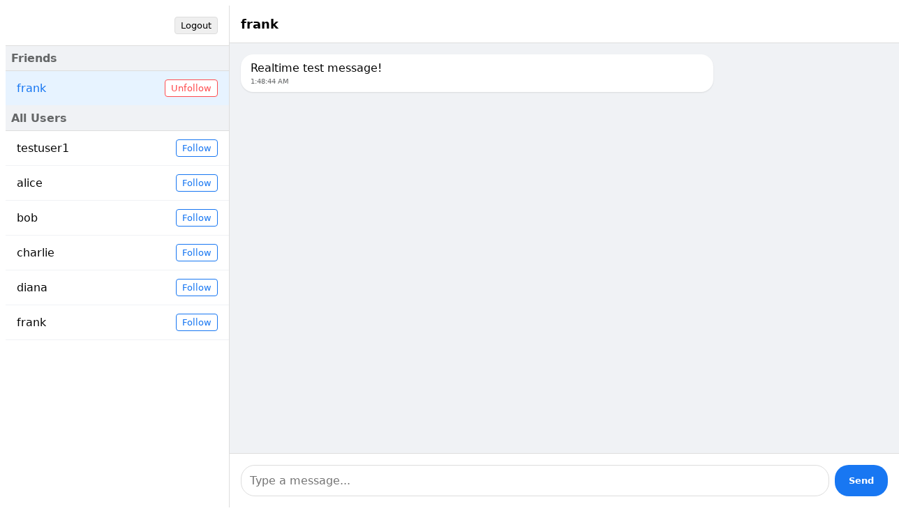 |

**セットアップ**:
```bash
# モデルダウンロード（I-Mini バリアント、13GB）
huggingface-cli download mudler/Qwopus3.6-35B-A3B-v1-APEX-GGUF \
  Qwopus3.6-35B-A3B-v1-APEX-I-Mini.gguf --local-dir ./models

# llama-server起動
llama-server -m ./models/Qwopus3.6-35B-A3B-v1-APEX-I-Mini.gguf \
  --port 8080 -c 32768 --n-gpu-layers 999
```

**評価**: Qwopus3.6はQwen 3.6 35B A3Bベースのモデルで、Claude Opusの構造化推論習慣を蒸留したとされる（⚠️ライセンス上の懸念あり）。I-Mini（13GB）は他のバリアント（I-Balanced 25GB、Full 70GB）と比較して最も軽量ながら、コーディングベンチマークで初回成功・80/80の完璧なスコアを達成。UIデザインも洗練されており、ログイン画面のセンタリング、フォローボタンの配色、チャット画面のタイムスタンプ表示など、細部まで丁寧に実装されている。13GBという軽量サイズでqwen3.6:35b-a3b-coding-mxfp8（37GB）と同等の性能を発揮し、メモリ効率が非常に高い。

---

### Ling-2.6-flash MLX 4bit

[inclusionAI/Ling-2.6-flash](https://huggingface.co/inclusionAI/Ling-2.6-flash)（104Bパラメータ、7.4B active）をMLXで動作テスト。

| 項目 | 結果 |
|---|---|
| モデル | mlx-community/Ling-2.6-flash-mlx-4bit-gs32 |
| サイズ | 65GB |
| 生成速度 | 56.3 tok/s |
| 生成時間 | 1612秒（リトライ含む） |
| リトライ | 3回 |
| 機能スコア | 45/80 |

- ✅ ビルド成功
- ❌ ログイン/サインアップ（React依存エラー）
- ✅ フレンドフォロー/解除（API）
- ✅ DM送受信（API）
- ❌ リアルタイム更新

| ログイン（React依存エラー） | フレンド（React依存エラー） | DM（React依存エラー） | チャット（React依存エラー） |
|---|---|---|---|
|  |  |  |  |

**セットアップ**:
```bash
# mlx-lm PR#1227からインストール（bailing_hybridサポート）
pip install git+https://github.com/ivanfioravanti/mlx-lm.git@add-ling-2.6-flash

# サーバー起動
python -m mlx_lm.server --model mlx-community/Ling-2.6-flash-mlx-4bit-gs32 --port 8080
```

**評価**: Ling-2.6-flashは104Bパラメータ（7.4B active）のMoEモデル。bailing_hybridアーキテクチャはmlx-lm本体では未サポートだが、PR#1227ブランチで動作確認。バックエンドAPIは正常に生成されるが、フロントエンドでReact/React-DOM依存関係が欠落し、「Failed to resolve import 'react/jsx-dev-runtime'」エラーが発生。56.3 tok/sはDeepSeek-V4-Flash（21.2 tok/s）の約2.7倍高速だが、コード品質に課題あり。

## 要約ベンチマーク (Mac Studio M3 Ultra 512GB, Ollama, n=10)

| Model | Size | Avg Time | Tok/s | ROUGE-1 | ROUGE-2 | ROUGE-L |
|---|---:|---:|---:|---:|---:|---:|
| gurubot/gpt-oss-derestricted:20b | 15GB | 11.3s | **108.4** | 0.527 | 0.240 | 0.233 |
| **gpt-oss:20b** | 13GB | 15.0s | 99.5 | 0.594 | 0.290 | 0.266 |
| gpt-oss-128k | 13GB | 12.7s | 98.8 | 0.568 | 0.278 | 0.267 |
| gpt-oss:20b-long | 13GB | 19.1s | 98.7 | 0.577 | 0.280 | 0.267 |
| Ternary-Bonsai-8B (MLX) | 2GB | 3.0s | 56.9 | 0.563 | 0.268 | 0.259 |
| **gemma3:12b** | 8.1GB | 5.4s | 48.5 | 0.607 | 0.299 | **0.298** |
| codestral:22b | 12GB | 21.6s | 37.7 | 0.534 | 0.201 | 0.215 |
| **qwen2.5:32b** | 19GB | 13.1s | 27.7 | **0.619** | **0.303** | 0.278 |

- **gurubot/gpt-oss-derestricted:20b**: M3 Ultra上で最速**108.4 tok/s**だが品質はやや低い
- **gpt-oss:20b**: 99.5 tok/sで速度と品質のバランスが良い
- **gemma3:12b**: 48.5 tok/sで**ROUGE-L 0.298**。速度と品質の両立
- **qwen2.5:32b**: 27.7 tok/sだが**ROUGE-1/ROUGE-2最高**。品質重視なら最適
- **codestral:22b**: コーディング特化モデル。要約タスクは苦手（ROUGE-L 0.215）
- **qwen3.6:35b-a3b**: 思考モデルのためOllamaの`/api/generate`で応答不可（0点）
- M3 Ultraの統合メモリ（512GB）により、32BパラメータモデルもVRAM制限なく動作

---

## Ternary-Bonsai-8B MLX 2-bit - Apple Silicon
- **ROUGE-L**: 0.259 | **Speed**: 56.9 tok/s | **Platform**: Apple M3 Ultra 512GB (MLX)

[prism-ml/Ternary-Bonsai-8B-mlx-2bit](https://huggingface.co/prism-ml/Ternary-Bonsai-8B-mlx-2bit) をMLXで動作テスト。

| 項目 | Ternary-Bonsai MLX 2-bit | Bonsai-8B GGUF 1-bit |
|---|---|---|
| Platform | M3 Ultra (MLX) | RTX 5090 (llama.cpp) |
| ROUGE-L | 0.259 | **0.400** |
| ROUGE-1 | 0.563 | **0.650** |
| ROUGE-2 | 0.268 | **0.359** |
| Speed | 56.9 tok/s | **325 tok/s** |
| Size | ~2GB | 1.16GB |
| 出力長安定性 | 210-387字 (やや長め) | ~200字 (安定) |

**評価**:
- ⚠️ GGUF 1-bit版(ROUGE-L 0.400)より**品質が大幅に低下**（ROUGE-L 0.259、-35%）
- ⚠️ M3 Ultra上で56.9 tok/s（RTX 5090のGGUF版325 tok/sの1/6）
- ⚠️ 出力がやや冗長になる傾向（平均251文字、最大387文字）
- ✅ Apple Silicon環境で動作可能
- ✅ UV + mlx-lm で簡単にセットアップ可能

**動作方法**:
```bash
uv init && uv add mlx mlx-lm
uv run python -c "
from mlx_lm import load, generate
model, tokenizer = load('prism-ml/Ternary-Bonsai-8B-mlx-2bit')
print(generate(model, tokenizer, prompt='日本の首都は？', max_tokens=256))
"
```

**結論**: Apple Silicon環境でBonsaiを使いたい場合の選択肢だが、品質・速度ともにGGUF 1-bit版に大きく劣る。MLX 2-bit量子化はGGUF 1-bitほど効率的ではない。

---

# DGX Spark (GB10) ベンチマーク

NVIDIA DGX Spark（GB10 GPU、統合メモリ128GB、aarch64）での推論速度比較。

### 要約ベンチマーク

| Model | Avg Time | Tok/s | ROUGE-1 | ROUGE-2 | ROUGE-L | 備考 |
|---|---:|---:|---:|---:|---:|---|
| 🆕 **Ternary-Bonsai-27B Q2_0** | 129.7s | 20.4 | 0.596 | 0.294 | **0.313** | 20/20成功、thinking有効、7.2GB |
| **gpt-oss:20b** | 61.3s | **27.8** | 0.617 | 0.336 | 0.310 | 安定動作 |
| qwen3.5:9b | 300s | 0.0 | 0.017 | 0.001 | 0.007 | 全サンプルタイムアウト |

- **gpt-oss:20b**: 27.8 tok/sで安定動作。ROUGE-L 0.310はA100（88 tok/s）の1/3の速度だが品質は同等
- **qwen3.5**: Thinkingモデルが300秒以内に回答を完了できず全滅。DGX SparkではGPU使用率96%（他プロセスと競合）が影響の可能性
- **Ternary-Bonsai-27B**: 詳細は[下記](#ternary-bonsai-27b-2-bit-ternary-gguf-dgx-spark)参照

### Ternary-Bonsai-27B (2-bit ternary GGUF, DGX Spark)

[prism-ml/Ternary-Bonsai-27B-gguf](https://huggingface.co/prism-ml/Ternary-Bonsai-27B-gguf)（Qwen3.6-27Bベースの3値量子化、真の1.71 bpw、7.17GB）を[PrismML llama.cppフォーク](https://github.com/PrismML-Eng/llama.cpp)（Q2_0_g128カスタムCUDAカーネル、sm_121a）で評価。2026-07-15実施。

**llama-bench (CUDA, -ngl 99, -fa 1)**

| Test | Tok/s |
|---|---:|
| pp512 | 928.3 ± 7.6 |
| tg128 | 29.6 ± 0.02 |

公式公表値と比較すると、GB10のtg128 29.6はApple M5 Pro (26.2) と M5 Max (44.0) の間、H100 (98.0) の約1/3。

**要約ベンチマーク (20サンプル)**: ROUGE-L **0.313** — 同一マシンのgpt-oss:20b (0.310) と同等品質。thinkingが平均約6,000文字と長く、5/20サンプルはmax_tokens=3072では思考のみで打ち切られたため8192で再実行して回収（表の平均時間はこの再実行分を含む）。GPU競合により実効tok/sは12〜28で変動。

**コーディングベンチマーク**: 55/100（視覚評価スキップのためFunctionalのみ、55/80）。Build/Server/ログイン/フレンドOK、DM送受信とリアルタイム更新が4試行とも未達成。総生成時間2,655s（15〜29 tok/s）。49.86GBのMistral-Medium-3.5-128B Q2_K（45/100、7,293s）を、1/7のモデルサイズ・1/3の時間で上回った。

**結論**: 7.2GBで20B級（gpt-oss:20b）と同等の日本語要約品質、コーディングでは128B Q2_Kを超えるスコア。2-bit ternaryとしては「95% of FP16」の宣伝文句に恥じない実用性。ただしthinkingが長く実効レイテンシは大きめ、稀に語彙の乱れ（「雪」→「スネ」等）が出る。

<details>
<summary>実行方法 (DGX Spark)</summary>

```bash
# PrismMLフォークをビルド (CUDA 13, sm_121a自動検出)
git clone --depth 1 https://github.com/PrismML-Eng/llama.cpp ~/llama-cpp-prismml
cd ~/llama-cpp-prismml && cmake -B build -DGGML_CUDA=ON -DLLAMA_CURL=OFF
cmake --build build -j $(nproc) --target llama-cli llama-server llama-bench

# モデル取得 (7.17GB)
hf download prism-ml/Ternary-Bonsai-27B-gguf Ternary-Bonsai-27B-Q2_0.gguf --local-dir ~/models

# サーバー起動
./build/bin/llama-server -m ~/models/Ternary-Bonsai-27B-Q2_0.gguf \
  -ngl 99 -c 32768 -fa auto --jinja --port 8081

# 要約ベンチ
python3 bonsai_gguf_benchmark.py --host 127.0.0.1:8081 --samples 20

# コーディングベンチ (OpenAI互換APIパスを強制、chat template適用のため必須)
CODING_BENCH_API=openai python3 coding_benchmark.py \
  --models "Ternary-Bonsai-27B-Q2_0" --host 127.0.0.1:8081 \
  --skip-visual --max-retries 3 --output coding_benchmark_bonsai27b.json
```
</details>

### コーディングベンチマーク (DGX Spark)

| Model | 生成時間 | Tok/s | リトライ | TOTAL | 備考 |
|---|---:|---:|---:|---:|---|
| 🆕 **Ternary-Bonsai-27B Q2_0** | 2,655s | 15-29 | 3/3 | **55/100** | PrismMLフォーク (7.17GB)、Login/Friend OK、DM/RT失敗、視覚評価なし |
| **Mistral-Medium-3.5-128B Q2_K** | 7,293s | 3.3 | 3/3 | 45/100 | bartowski Q2_K (49.86GB)、Build/Server OK、Login UI失敗 |

詳細は[コーディングベンチマーク § Mistral-Medium-3.5-128B Q2_K](#mistral-medium-35-128b-q2k45点--リトライ3回-)を参照。

---

# 大規模モデル（A100）テスト

### qwen3:235b-a22b (MoE)

8x A100 80GB環境でのテスト結果。

| 項目 | 値 |
|------|-----|
| パラメータ | 235B (22B active) |
| 速度 | 35-37 tok/s |
| VRAM使用量 | 142GB |

**要約タスク結果**:
- **ROUGE-L**: 0.518 | **Speed**: 35 tok/s | **Size**: 142GB

**生成例**:
> 要約: LLMの進化で、ユーザーに最適化されたパーソナルAIが加速。汎用モデルから目的・ユーザー別モデルへ移行し、AgenticAIはメール返信や意思決定を担う。技術戦略では人間性や倫理が重要視され、欧州はプライバシー、北米は市場主導のAI倫理アプローチが対比される。

**評価**:
- ✅ ROUGE-L 0.518で高精度
- ✅ 詳細なThinking過程を出力
- ✅ 要約品質が非常に高い
- ⚠️ 142GB VRAMが必要（8x A100 80GB）
- ⚠️ 速度は35 tok/sと遅め

**キーワード抽出例**:
```
Q: 機械学習について教えて
A: {"keywords": ["機械学習"]}

Q: CNNとRNNの違いは?
A: {"keywords": ["CNN", "RNN", "違い"]}
```

**評価**:
- ✅ Thinkingモードで詳細な推論過程を出力
- ✅ キーワード抽出精度は高い
- ⚠️ 速度は中程度（35 tok/s）
- ⚠️ 大規模VRAMが必要（142GB）

---

### DeepSeek-V4-Flash MXFP4_MOE - A100 80GB ×3 / DGX Spark (Blackwell GB10)

DeepSeek-V4-Flash（284B params / 13B active MoE、43層、HCA hybrid attention）を MXFP4_MOE GGUF（140GB、`lovedheart/DeepSeek-V4-Flash-GGUF`）で動作させた検証結果。`llama.cpp` 本体は未マージのため [PR#22378 (nisparks fork)](https://github.com/ggml-org/llama.cpp/pull/22378) を自前ビルドして使用。

#### A100 80GB × 3 (Ampere sm_80, 3-way tensor split, llama.cpp PR#22378)

| Metric | 値 |
|---|---|
| 起動構成 | `-ngl 99 -c 16384 -fa auto --cache-ram 0 --no-cache-prompt -np 1 --no-jinja` |
| 速度 (gen) | 22 tok/s |
| 速度 (prefill) | 23 tok/s（HCA prefill 未最適化） |
| ROUGE-1 / 2 / **L** (20 sample) | 0.509 / 0.221 / **0.234** |
| ROUGE-L（有効18件のみ）| 0.260 |
| 空応答失敗率 | 2/20 (10%) |
| Coding bench | **25/100** (10 retry, build OK のみ得点) |

**問題点（A100特有）**:
- A100 (sm_80) は FP4/FP8 native MMA 命令を持たず、PR#22378 が dequant→BF16 emulation 経路を辿る
- 出力に **broken UTF-8 byte（U+FFFD）が混入** し、長い日本語生成で `応用` → `応`、`市民参加` → `市民参` のように 3-byte UTF-8 文字の途中バイトが落ちる
- llama-server の non-stream JSON serializer がこの broken byte を含む応答で 500 エラーを返し、要約タスクで時々 0 トークン応答になる
- ROUGE-L 0.234 は **下限値**（broken byte によりスコアが押し下げられている）

#### DGX Spark (NVIDIA GB10, Blackwell sm_120, native MXFP4)

DGX Spark は **GB10 (Blackwell) + 119GB unified memory + aarch64**。BLACKWELL_NATIVE_FP4 経路で動かすことで broken UTF-8 byte 問題が大幅に軽減することを確認。

| Metric | 値 |
|---|---|
| 起動構成 | `-ngl 0 -c 8192 --cache-ram 0 --no-jinja --no-context-shift` (140GB GGUF を mmap、unified memory < モデルサイズ) |
| 速度 (gen) | **1.3 tok/s**（unified memory 不足で disk mmap 律速） |
| 速度 (prefill) | ~1 tok/s |
| ROUGE-1 / 2 / **L** (5 sample) | 0.623 / 0.338 / **0.302** |
| 空応答失敗率 | **0/5 (0%)** |
| Coding bench | 0/100 (1 retry; build OK だが server starts NG) |

**A100 → Spark の品質差**:

| Metric | A100 (broken UTF-8) | DGX Spark (native MXFP4) | 改善 |
|---|---|---|---|
| ROUGE-L | 0.234 / (0.260) | **0.302** | +29% / (+16%) |
| ROUGE-1 | 0.509 | **0.623** | +22% |
| ROUGE-2 | 0.221 | **0.338** | +52% |
| 空応答失敗 | 2/20 | **0/5** | 解消 |

**注意点（Spark 特有）**:
- **GB10 unified memory 119GB < モデル 140GB**。`-ngl > 0`（部分 GPU 配置）を試みると warmup 時の cuda graph 確保で OOM、結果サーバが ggml_abort
- 唯一安定動作するのは `-ngl 0`（全層 mmap、disk から demand-paging）
- Disk read が律速で gen 1.3 tok/s。20 サンプルベンチに 27時間かかる試算のため 5 サンプルで打ち切り
- **要約タスク（短文生成）では broken byte ほぼ出ない**。一方 8000+ token を吐く coding bench では Spark でも稀に broken byte → 500 エラー発生。本リポでは `_call_llama_cpp` を **stream=true** に書き換えて partial output を救出する形で回避

**結論**:
- V4-Flash の真の品質値は ROUGE-L **0.30 前後**（A100 で観測された 0.23 はインフラ不具合での下振れ）
- それでも RTX 5090 の Qwopus3.5-9B (0.533) や Qwen3.5-9B (0.492) には届かず
- 「Flash 13B-active MoE は既存 9B-class モデル群を超える知能を発揮しない」が現時点の判定
- **公式 inference (`inference/generate.py` + tilelang FP8 GEMM) は A100 では sm_89+ 専用の CUTLASS 命令で動作不可**、DGX Spark でも 158GB FP8 がメモリに乗らず、現状 A100/Spark での "公式品質" 評価は不可能

**動作方法 (A100)**:
```bash
# llama.cpp PR#22378 fork をビルド (CUDA, sm_80)
git clone --depth 1 -b wip/deepseek-v4-support \
  https://github.com/nisparks/llama.cpp.git llama-cpp-deepseek-v4
cd llama-cpp-deepseek-v4 && cmake -B build -DGGML_CUDA=ON \
  -DCMAKE_CUDA_ARCHITECTURES=80 && cmake --build build -j$(nproc)

# MXFP4_MOE GGUF を取得 (140GB)
hf download lovedheart/DeepSeek-V4-Flash-GGUF \
  DeepSeek-V4-Flash-MXFP4_MOE.gguf --local-dir ./models

# 3 GPUに tensor split で起動
CUDA_VISIBLE_DEVICES=0,1,2 ./build/bin/llama-server \
  -m ./models/DeepSeek-V4-Flash-MXFP4_MOE.gguf \
  -ngl 99 -c 16384 -fa auto \
  --cache-ram 0 --no-cache-prompt -np 1 --no-jinja \
  --host 0.0.0.0 --port 18091
```

**動作方法 (DGX Spark)**:
```bash
# 同じ PR#22378 fork を aarch64 + sm_120 でビルド
cmake -B build -DGGML_CUDA=ON -DCMAKE_CUDA_ARCHITECTURES=120 \
  && cmake --build build -j$(nproc)

# DGX Spark の場合は -ngl 0（全mmap）が必須
./build/bin/llama-server \
  -m ./models/DeepSeek-V4-Flash-MXFP4_MOE.gguf \
  -ngl 0 -c 8192 -fit off --no-warmup \
  --cache-ram 0 --no-cache-prompt -np 1 --no-jinja \
  --host 0.0.0.0 --port 18091
```

---

### llm-jp-4-32b-a3b-thinking (NEW!) - A100 80GB ×1

国立情報学研究所 LLM-jp チームの **Apache 2.0** ライセンスの 32.1B params / 3.8B active MoE thinking モデル ([llm-jp/llm-jp-4-32b-a3b-thinking](https://huggingface.co/llm-jp/llm-jp-4-32b-a3b-thinking))。`qwen3moe` アーキテクチャ + OpenAI Harmony 互換 chat template。Q4_K_M GGUF ([alfredplpl/llm-jp-4-32b-a3b-thinking-gguf](https://huggingface.co/alfredplpl/llm-jp-4-32b-a3b-thinking-gguf)、19.9GB) を A100 80GB ×1 で動作。

#### 要約 (ROUGE) ベンチマーク - 20 sample

| Metric | 値 |
|---|---|
| ROUGE-1 / 2 / **L** | 0.531 / 0.236 / **0.237** |
| 速度 (gen) | **161 tok/s** |
| 平均 sample 時間 | 6.0秒 |
| 完走 | 20/20 |

#### コーディング (React chat app) ベンチマーク

| Metric | 値 |
|---|---|
| **Total** | **25/100** |
| Functional | 25/80 (Build OK のみ得点、Login/Friend/DM/RT は不達) |
| Visual | 0/20 (skip) |
| 1次生成 | 18,946 chars in 39.9s @ **175 tok/s**、13 files |
| 総時間 (10 retry含む) | **424秒 (7分)** |
| 速度 | DeepSeek-V4-Flash A100 (148分) の **約20倍速い** |

**評価**:
- ✅ Apache 2.0、商用利用可
- ✅ 32.1B params / 3.8B active = 推論時VRAM 13GB程度で動作 (1×A100で十分)
- ✅ 161-175 tok/s の高速生成 (Mac Studio の qwen3.6:35b-a3b-coding 73 tok/s より速い)
- ✅ Reasoning: medium で高品質な分析過程を出力 (英語で考えて日本語で答える、内部 reasoning 経路)
- ⚠️ ROUGE-L 0.237 は中位 (V4-Flash A100 0.234 と同範囲、Qwen3.5-9B 0.492 より低い)
- ⚠️ Coding bench 25/100 (Build成功するが Express + Vite frontend の起動が10 retry中一度も成功せず)
- ⚠️ thinking が長く出力上限に達して final 章節に到達しないサンプルあり (要約で sample 16, 17 等 ROUGE-L 0.05 前後)

**注意点 (環境構築)**:
- 標準 llama.cpp (b1-beb42ff 以降) でビルドして使うこと。**[PR#22378 (DeepSeek-V4 fork)](https://github.com/ggml-org/llama.cpp/pull/22378) のビルドでは degenerate な無限ループ出力**になる (qwen3moe builder の Harmony token 互換性不足)
- llama.cpp の `--jinja` chat template は thinking 出力に `<|channel|> analysis<|message|>` (スペース有り) を含むため、サーバ側 Harmony parser が **500エラー**で失敗。**`/completion` エンドポイント + 手動 Harmony format prompt + `stop=["<|return|>"]`** で回避必要
- 出力の `<|channel|>final<|message|>...` 章節を抽出して評価する必要あり

**動作方法**:
```bash
# 標準 llama.cpp HEAD をビルド (CUDA, sm_80)
git clone --depth 1 https://github.com/ggml-org/llama.cpp.git && cd llama.cpp
cmake -B build -DGGML_CUDA=ON -DCMAKE_CUDA_ARCHITECTURES=80 \
  && cmake --build build -j$(nproc)

# Q4_K_M GGUF を取得 (19.9GB)
hf download alfredplpl/llm-jp-4-32b-a3b-thinking-gguf \
  llm-jp-4-32B-a3B-thinking-Q4_K_M.gguf --local-dir ./models

# サーバ起動
./build/bin/llama-server \
  -m ./models/llm-jp-4-32B-a3B-thinking-Q4_K_M.gguf \
  -ngl 99 -c 32768 -fa auto --jinja \
  --host 0.0.0.0 --port 8080

# /completion へ Harmony プロンプトを直接送る (chat-completions endpoint は parser bug で 500)
curl http://localhost:8080/completion -H "Content-Type: application/json" -d '{
  "prompt": "<|start|>user<|message|>17×23を計算してください。<|end|><|start|>assistant",
  "n_predict": 2000, "temperature": 0.3,
  "stop": ["<|return|>"]
}'
```

---

### Qwen3.5-9B-DeepSeek-V4-Flash (蒸留, NEW!) - A100 80GB ×1

[Jackrong/Qwen3.5-9B-DeepSeek-V4-Flash](https://huggingface.co/Jackrong/Qwen3.5-9B-DeepSeek-V4-Flash-GGUF) は **Qwen3.5-9B をベースに DeepSeek-V4-Flash の reasoning trace で SFT (Unsloth、8000 サンプル distillation)** された **Apache 2.0** ライセンス 9B reasoning モデル。`qwen35` アーキテクチャ、ChatML format、Long-CoT 思考過程を出力する。Q4_K_M GGUF (5.6GB) を A100 80GB ×1 で動作。

#### 要約 (ROUGE) ベンチマーク - 20 sample

| Metric | 値 |
|---|---|
| ROUGE-1 / 2 / **L** | 0.460 / 0.210 / **0.212** |
| 速度 (gen) | 118 tok/s |
| 平均 sample 時間 | 97秒 (max_tokens 16384) |
| 完走 | 20/20 (うち 4件は thinking が 16k token 全消費で content 空 → 0点) |

#### コーディング (React chat app) ベンチマーク

| Metric | 値 |
|---|---|
| **Total** | **25/100** |
| Functional | 25/80 (Build OK + **Server起動成功**、Login/Friend/DM/RT は不達) |
| Visual | 0/20 (skip) |
| 1次生成 | 0 chars (思考が 32k token 全消費して content 出ず) |
| 最高ファイル数 | 14 files (retry 5, 10) |
| 総時間 (10 retry含む) | **22分 (1330秒)** |

**評価**:
- ✅ Apache 2.0、9B 軽量、A100 1枚で十分動作 (5.6GB Q4_K_M)
- ✅ chat-completions endpoint がそのまま動く (DeepSeek-V4 系と違い 500 バグなし)
- ✅ **Coding bench で Server起動成功** (V4-Flash 本家 / llm-jp-4 は build OK のみ、frontend起動失敗) → distillation の恩恵で frontend 構造を正しく組める
- ⚠️ ROUGE-L 0.212 はベース Qwen3.5-9B (0.492) から **大きく低下** — DeepSeek-V4 思考スタイルへの SFT で要約タスク向け簡潔出力能力が損なわれた
- ⚠️ Long-CoT で 16k+ token を平気で消費する。max_tokens 設定要注意 (4096 だと content 空になる)
- ⚠️ Login/Friend/DM 全テスト未通過は 25/100 の天井組と同じ (V4-Flash A100、llm-jp-4 と同点)

**動作方法**:
```bash
# 標準 llama.cpp HEAD (qwen35 + reasoning パーサ対応版)
git clone --depth 1 https://github.com/ggml-org/llama.cpp.git && cd llama.cpp
cmake -B build -DGGML_CUDA=ON -DCMAKE_CUDA_ARCHITECTURES=80 \
  && cmake --build build -j$(nproc)

# Q4_K_M GGUF を取得 (5.6GB)
hf download Jackrong/Qwen3.5-9B-DeepSeek-V4-Flash-GGUF \
  Qwen3.5-9B-DeepSeek-V4-Flash-Q4_K_M.gguf --local-dir ./models

# サーバ起動 (推奨: temperature=0.6, top_p=0.95)
./build/bin/llama-server \
  -m ./models/Qwen3.5-9B-DeepSeek-V4-Flash-Q4_K_M.gguf \
  -ngl 99 -c 32768 -fa auto --jinja \
  --host 0.0.0.0 --port 8080

# /v1/chat/completions が普通に動く (max_tokens は 8192 以上推奨)
curl http://localhost:8080/v1/chat/completions -H 'Content-Type: application/json' -d '{
  "messages": [{"role":"user","content":"17×23を計算してください"}],
  "max_tokens": 16384, "temperature": 0.6, "top_p": 0.95
}'
```

---

### gemma4-31B-Opus (NEW!) - A100 80GB
- **ROUGE-L**: 0.401 | **Speed**: 27.8 tok/s | **Size**: 18.7GB (Q4_K_M)

> ⚠️ **ライセンス上の懸念**: このモデルは「Claude Opus 4.6の推論トレース」で訓練されたと明記されています。Qwopusと同様のライセンスリスクにご注意ください。

**生成例 (Sample 0)**:
> 大規模言語モデルの進化により、個人の思考パターンを学習したAIが業務を代行するデジタルツインの実現が期待されています。一方で、情報の信頼性や透明性、プライバシー保護といった倫理的課題も浮き彫りとなっています。欧米とアジアで規制アプローチが異なる中、国際的な標準策定には多角的な協議が不可欠です。

**評価**:
- ✅ Gemma 4ベースの31Bパラメータモデル
- ✅ 高品質な日本語要約を生成
- ✅ 詳細な内容を適切な長さでまとめる
- ⚠️ 18.7GB VRAMが必要（A100推奨）
- ⚠️ 速度は27.8 tok/sと低め
- ⚠️ **Claude Opus 4.6蒸留によるライセンスリスク**

**動作方法**:
```bash
# モデルをダウンロード (18.7GB)
wget -O gemma4-31B-opus.q4_k_m.gguf \
  "https://huggingface.co/TeichAI/gemma-4-31B-it-Claude-Opus-Distill-GGUF/resolve/main/gemma-4-31B-it-Claude-Opus-Distill.q4_k_m.gguf"

# llama-server で起動
./build/bin/llama-server -m gemma4-31B-opus.q4_k_m.gguf \
  -c 32768 -ngl 99 --host 0.0.0.0 --port 8080
```

---

### poolside Laguna-XS-2.1 (NEW!) - A100 80GB ×1

[poolside/Laguna-XS-2.1](https://huggingface.co/poolside/Laguna-XS-2.1) は poolside の **33.4B params / 約3B active MoE**（256 experts × top-8 + shared expert）thinking モデル。カスタム `laguna` アーキテクチャ、YaRN で 262,144 token コンテキスト。SWE-bench 系のコーディング特化モデル。公式 GGUF ([poolside/Laguna-XS-2.1-GGUF](https://huggingface.co/poolside/Laguna-XS-2.1-GGUF)) の Q4_K_M (19GB) を A100 80GB ×1 で動作（thinking 有効）。

#### 要約 (ROUGE) ベンチマーク - 10 sample

| Metric | 値 |
|---|---|
| ROUGE-1 / 2 / **L** | 0.465 / 0.230 / **0.227** |
| ROUGE-L（有効9件のみ） | 0.252 |
| 速度 (gen) | **155 tok/s** |
| 平均 sample 時間 | 27.6秒 |
| 完走 | 10/10 (うち1件は thinking が 32k token 全消費で content 空 → 0点) |

#### コーディング (React chat app) ベンチマーク

| Metric | 値 |
|---|---|
| **Total** | **75/100** |
| Functional | **75/80** (Build/Server/Login/Friend/DM/**Realtime 全通過**、1項目が API-only 判定で -5) |
| Visual | 12/20 (ローカルVLM qwen2.5vl:32b による参考値、TOTAL不算入。素のHTML風で機能は揃うが装飾なし) |
| 1次生成 | 20,273 chars in 38.4s @ **148 tok/s**、7 files |
| リトライ | 5回 (attempt 1 で 55/80 → attempt 6 で Realtime 含め全テスト通過) |
| 総生成時間 | **214秒** |

**評価**:
- ✅ **A100 ×1 (Q4_K_M 19GB + KV) で動く 33B MoE として Coding 75/100 は上位**（gpt-oss:20b、Qwen3.6-27B-MTP Q8_0 baseline と同点、80点組の次点）
- ✅ 難関のリアルタイム更新（2秒ポーリング）テストを通過（55点止まりのモデルが多い中で差別化点）
- ✅ 148-155 tok/s の高速生成（thinking 込みでも1次生成は38秒）
- ✅ llama.cpp master が `laguna` アーキテクチャを標準サポート、公式 GGUF あり
- ⚠️ 生成された UI はほぼ素の HTML（CSS 未適用）。機能は揃うがデザイン品質は低い
- ⚠️ ROUGE-L 0.227 は中位 (llm-jp-4-32B-a3B 0.237 と同範囲)。コーディング特化モデルであり日本語要約は得意分野ではない
- ⚠️ thinking が長く、要約タスクで 32k token 上限まで思考し続けて回答空になるサンプルあり (10件中1件)

**注意点 (環境構築)**:
- llama.cpp master のビルドに **CUDA 12.x が必要**（nvcc 11.8 では PDL API 未定義でコンパイルエラー）。`-DCMAKE_CUDA_COMPILER=/usr/local/cuda-12.9/bin/nvcc` 等で指定
- chat template のデフォルトは thinking 無効。**`--chat-template-kwargs '{"enable_thinking": true}'`** で公式デフォルト（thinking 有効）に合わせる
- llama-server が thinking を `reasoning_content` に分離するため、`/v1/chat/completions` の `content` はクリーンな最終回答のみ
- ベンチ実行時は `CODING_BENCH_API=openai`（coding）/ `BENCH_API=openai BENCH_MAX_TOKENS=32768`（要約）で OpenAI 互換 chat 経路を使用（既存の llama.cpp 経路は DeepSeek 専用トークンでラップするため不可）

**動作方法**:
```bash
# 標準 llama.cpp master をビルド (CUDA 12.x, sm_80)
git clone --depth 1 https://github.com/ggml-org/llama.cpp.git && cd llama.cpp
cmake -B build -DGGML_CUDA=ON -DCMAKE_CUDA_ARCHITECTURES=80 \
  -DCMAKE_CUDA_COMPILER=/usr/local/cuda-12.9/bin/nvcc \
  && cmake --build build --target llama-server -j$(nproc)

# 公式 Q4_K_M GGUF を取得 (19GB)
hf download poolside/Laguna-XS-2.1-GGUF Laguna-XS-2.1-Q4_K_M.gguf --local-dir ./models

# サーバ起動 (thinking 有効)
./build/bin/llama-server -m ./models/Laguna-XS-2.1-Q4_K_M.gguf \
  -ngl 999 -c 131072 -fa on --jinja \
  --chat-template-kwargs '{"enable_thinking": true}' \
  --host 0.0.0.0 --port 8089

# ベンチマーク実行
BENCH_API=openai BENCH_MAX_TOKENS=32768 python3 benchmark.py \
  --dataset ~/dataset_from_logs.jsonl --models "laguna-xs-2.1:33b-a3b-q4km" \
  --samples 10 --host 127.0.0.1:8089 --output laguna_xs21_summary_results.json
CODING_BENCH_API=openai python3 coding_benchmark.py \
  --models "laguna-xs-2.1:33b-a3b-q4km" --host 127.0.0.1:8089 \
  --output coding_benchmark_laguna_xs21.json --skip-visual
```

---

## 特殊環境が必要なモデル

### Qwopus3.5-9B-v3-GGUF
- **状態**: ✅ llama.cpp で動作確認済み
- **注意**: Ollama 0.20.0でも`qwen35`アーキテクチャ未サポート
- **対策**: llama.cpp を使用（上記S+ Tierセクション参照）

### Bonsai-8B-gguf
- **状態**: ✅ PrismML版llama.cppで動作確認済み
- **注意**: 1-bit量子化(Q1_0)は標準llama.cppでは非対応
- **対策**: PrismML版llama.cppを使用（上記A Tierセクション参照）

---

## APPENDIX

技術的な詳細テスト結果は [APPENDIX.md](APPENDIX.md) を参照:

- OneCompression 量子化テスト
- Quansloth TurboQuant コンテキスト拡張テスト
- Needle-in-Haystack ベンチマーク
- U字曲線の深掘り分析
- TurboQuant vs FP16 比較実験
- RotorQuant KVキャッシュ圧縮ベンチマーク

---

## License

MIT
